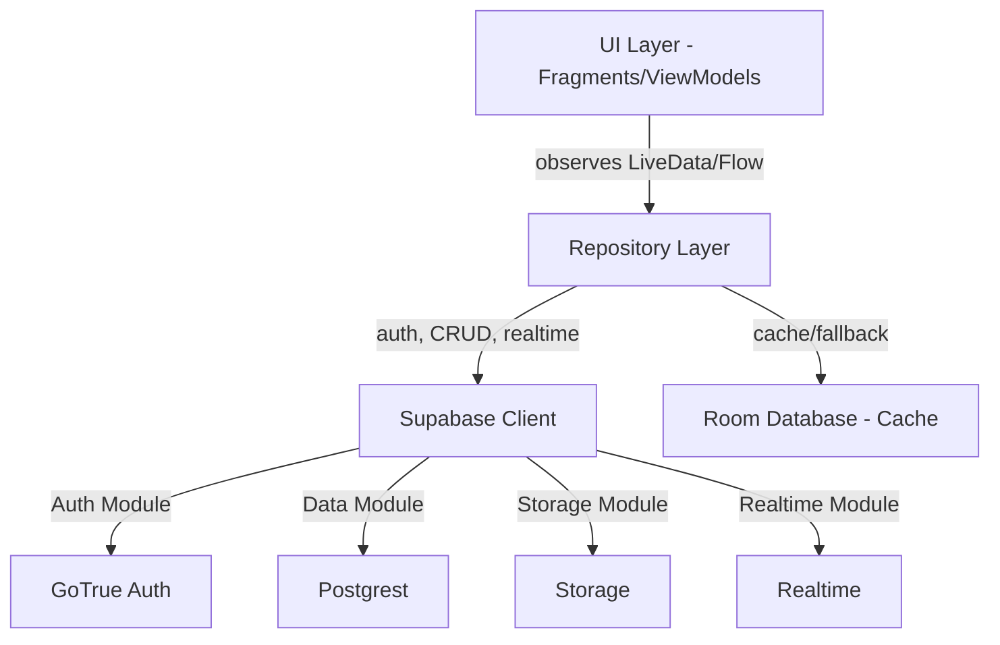
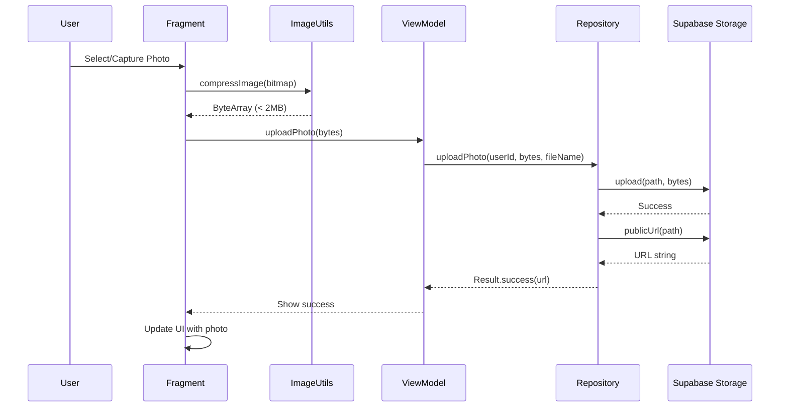
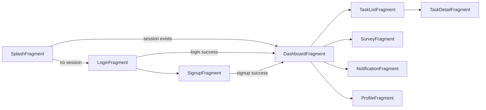

# Design Document: Hackathon-Readiness Integration

## Overview

This design document specifies the technical implementation for making the APX-GP Android application fully functional and hackathon-ready. The application connects volunteers with disaster relief tasks using a complete Supabase backend infrastructure.

### Purpose

Transform the APX-GP Android application from a prototype with mock data into a production-ready system that seamlessly integrates with the verified Supabase backend for authentication, real-time data synchronization, storage, and machine learning risk score integration.

### Scope

This design covers:
- Supabase client initialization and secure credential management
- Complete repository layer implementation for all data operations
- Authentication flows with session persistence
- Storage integration for image uploads (survey photos, profile photos)
- Realtime subscription architecture for live data updates
- ML Bridge for survey data export and risk score import
- Offline support with Room database caching
- Error handling and validation strategies
- Navigation flow and screen lifecycle management
- Security considerations and data validation

### Key Constraints

- **Database schema is FINAL** - No modifications to existing Supabase tables
- **Existing tables**: volunteers, surveys, tasks, task_updates, notifications, area_risk_scores
- All repositories must eliminate mock data and connect to Supabase
- Credentials managed via local.properties and BuildConfig
- Support offline mode with Room caching for tasks
- Target API level: Android 26+ (Android 8.0 Oreo)
- Project URL: https://svtlldsfpahjxrttdnkj.supabase.co

### Success Criteria

1. All 36 requirements implemented and verified
2. Authentication flows working end-to-end
3. Real-time data synchronization operational
4. Image uploads functional for surveys and profiles
5. Offline task viewing with cached data
6. ML Bridge operational for risk score integration
7. Zero crashes during demo scenarios
8. Clean error handling with user-friendly messages

## Architecture

### High-Level Architecture



### Architectural Layers

#### 1. UI Layer
- **Components**: Fragments, ViewModels, Adapters
- **Responsibilities**: User interaction, state rendering, navigation
- **Technology**: Android View system, ViewBinding, Navigation Component
- **State Management**: ViewModel + LiveData/Flow

#### 2. Repository Layer
- **Components**: Repository classes (AuthRepository, TaskRepository, SurveyRepository, etc.)
- **Responsibilities**: Data access abstraction, business logic, caching strategy
- **Error Handling**: Result<T> wrapper for success/failure states
- **Caching**: Room database for offline support

#### 3. Supabase Client Layer
- **Components**: SupabaseClientProvider singleton
- **Modules**: Auth (GoTrue), Postgrest, Storage, Realtime
- **Initialization**: Eager initialization with credential validation
- **Configuration**: BuildConfig-based URL and API key injection

#### 4. Local Database Layer
- **Components**: Room database (AppDatabase), DAOs, Entities
- **Purpose**: Offline caching for tasks
- **Strategy**: Write-through cache (save on successful fetch, read on failure)

#### 5. Dependency Injection
- **Framework**: Hilt (Dagger)
- **Modules**: AppModule provides SupabaseClient, Room Database, Repositories
- **Scope**: Singleton for repositories and database instances

### Data Flow Patterns

#### Read Operation (with caching)
```
ViewModel → Repository.getData()
           ↓
Repository tries Supabase fetch
           ↓
    Success: Save to Room + return data
    Failure: Query Room for cached data
           ↓
ViewModel receives Result<Data>
           ↓
Fragment updates UI
```

#### Write Operation
```
ViewModel → Repository.saveData()
           ↓
Repository validates input
           ↓
Repository calls Supabase API
           ↓
    Success: Return Result.success()
    Failure: Return Result.failure(exception)
           ↓
ViewModel receives Result
           ↓
Fragment shows success/error message
```

#### Realtime Subscription
```
Fragment (onViewCreated) → Repository.subscribeChanges()
                          ↓
Repository creates Realtime channel
                          ↓
Returns Flow<PostgresAction>
                          ↓
ViewModel collects Flow
                          ↓
On emission: Refresh data from repository
                          ↓
Fragment observes refreshed data
```

## Components and Interfaces

### 1. Supabase Client Provider

**File**: `data/remote/SupabaseClientProvider.kt`

**Responsibility**: Singleton providing configured SupabaseClient instance

**Interface**:
```kotlin
object SupabaseClientProvider {
    val client: SupabaseClient
}
```

**Implementation Details**:
- Initialized on first access using object singleton pattern
- Validates BuildConfig.SUPABASE_URL and BuildConfig.SUPABASE_ANON_KEY in init block
- Throws IllegalArgumentException if credentials are blank
- Installs Auth, Postgrest, Storage, Realtime modules
- Uses Ktor client for Android

**Design Decision**: Object singleton provides guaranteed single instance without Hilt complexity for this component. Hilt provides the client to repositories.

### 2. Authentication Repository

**File**: `data/repository/AuthRepository.kt`

**Responsibility**: User authentication operations and session management

**Interface**:
```kotlin
class AuthRepository @Inject constructor(
    private val supabaseClient: SupabaseClient
) {
    suspend fun signUp(
        email: String,
        password: String,
        fullName: String,
        phone: String,
        role: String,
        area: String,
        skills: List<String>,
        availability: String
    ): Result<Unit>
    
    suspend fun login(email: String, password: String): Result<Unit>
    suspend fun logout(): Result<Unit>
    fun isLoggedIn(): Boolean
    fun getCurrentUserId(): String?
}
```

**Implementation Details**:
- `signUp`: Creates auth user via GoTrue, then inserts volunteer profile record
- `login`: Authenticates user and establishes session (GoTrue handles session persistence)
- `logout`: Signs out user and clears session
- `isLoggedIn`: Checks if currentSessionOrNull() exists
- `getCurrentUserId`: Returns currentUserOrNull()?.id

**Error Handling**:
- Duplicate email: Supabase returns specific error, map to "Email already registered"
- Invalid credentials: Supabase returns auth error, map to "Invalid email or password"
- Network errors: Catch exceptions and wrap in Result.failure()

### 3. Profile Repository

**File**: `data/repository/ProfileRepository.kt`

**Responsibility**: Volunteer profile data operations

**Interface**:
```kotlin
class ProfileRepository @Inject constructor(
    private val supabaseClient: SupabaseClient
) {
    suspend fun getProfile(volunteerId: String): Result<Volunteer>
    suspend fun updateProfile(volunteer: Volunteer): Result<Unit>
    suspend fun uploadProfilePhoto(userId: String, imageBytes: ByteArray, fileName: String): Result<String>
    suspend fun updateProfilePhotoUrl(userId: String, photoUrl: String): Result<Unit>
}
```

**Implementation Details**:
- `getProfile`: Fetches volunteer record by id using Postgrest
- `updateProfile`: Updates volunteer record fields (full_name, phone, area, skills, availability, updated_at)
- `uploadProfilePhoto`: Uploads to profile-photos bucket, returns public URL
- `updateProfilePhotoUrl`: Updates volunteer.profile_photo_url field

**Design Decision**: Profile photo upload returns URL, then separate call updates the database. This allows retrying URL update without re-uploading the image.

### 4. Survey Repository

**File**: `data/repository/SurveyRepository.kt`

**Responsibility**: Survey submission and retrieval operations

**Interface**:
```kotlin
class SurveyRepository @Inject constructor(
    private val supabaseClient: SupabaseClient
) {
    suspend fun submitSurvey(survey: Survey): Result<Unit>
    suspend fun getMySurveys(volunteerId: String): Result<List<Survey>>
    suspend fun getRecentSurveys(volunteerId: String, limit: Int): Result<List<Survey>>
    suspend fun getAllSurveys(): Result<List<Survey>>
    suspend fun uploadPhoto(userId: String, imageBytes: ByteArray, fileName: String): Result<String>
    fun subscribeSurveyChanges(): Flow<PostgresAction>
}
```

**Implementation Details**:
- `submitSurvey`: Validates input (severity 1-5, lat/lng ranges), inserts survey record
- `getMySurveys`: Fetches surveys for volunteer_id ordered by created_at DESC
- `getRecentSurveys`: Fetches limited surveys for dashboard
- `getAllSurveys`: Fetches all surveys (for ML bridge)
- `uploadPhoto`: Uploads to survey-photos bucket with path {userId}/{fileName}
- `subscribeSurveyChanges`: Creates realtime channel for surveys table

**Validation Rules**:
- Severity: 1-5 (inclusive)
- Latitude: -90 to 90 (if not null)
- Longitude: -180 to 180 (if not null)
- Category, description, location_name: non-empty (validated in UI)

### 5. Task Repository

**File**: `data/repository/TaskRepository.kt`

**Responsibility**: Task data operations with offline caching support

**Interface**:
```kotlin
class TaskRepository @Inject constructor(
    private val supabaseClient: SupabaseClient,
    private val taskDao: TaskDao
) {
    suspend fun getOpenTasks(): Result<List<Task>>
    suspend fun getMyTasks(volunteerId: String, status: String): Result<List<Task>>
    suspend fun getTaskById(taskId: String): Result<Task>
    suspend fun acceptTask(taskId: String, volunteerId: String): Result<Unit>
    suspend fun completeTask(taskId: String, note: String): Result<Unit>
    suspend fun updateFieldNotes(taskId: String, notes: String): Result<Unit>
    fun subscribeTaskChanges(): Flow<PostgresAction>
    fun getCachedTasksFlow(status: String): Flow<List<Task>>
}
```

**Implementation Details**:
- All read operations: Try Supabase first, fallback to Room on failure
- All successful reads: Update Room cache (write-through)
- `acceptTask`: Updates status=ongoing, assigns volunteer, sets started_at
- `completeTask`: Updates status=completed, sets completed_at and completion_note
- `updateFieldNotes`: Updates field_notes and updated_at
- `subscribeTaskChanges`: Realtime channel for tasks table
- `getCachedTasksFlow`: Observes Room database for UI updates

**Caching Strategy**:
1. Fetch from Supabase
2. On success: Clear old cache for status, insert new data, return data
3. On failure: Query Room by status/volunteer, return cached data if exists
4. Return cached data or failure

**Design Decision**: Only tasks are cached (not surveys/notifications) because tasks are most critical for offline field work scenarios.

### 6. Task Update Repository

**File**: `data/repository/TaskUpdateRepository.kt`

**Responsibility**: Task progress update operations

**Interface**:
```kotlin
class TaskUpdateRepository @Inject constructor(
    private val supabaseClient: SupabaseClient
) {
    suspend fun createTaskUpdate(taskUpdate: TaskUpdate): Result<Unit>
    suspend fun getTaskUpdates(taskId: String): Result<List<TaskUpdate>>
    suspend fun uploadUpdatePhoto(userId: String, imageBytes: ByteArray, fileName: String): Result<String>
    fun subscribeTaskUpdateChanges(): Flow<PostgresAction>
}
```

**Implementation Details**:
- `createTaskUpdate`: Inserts task_updates record
- `getTaskUpdates`: Fetches updates for task_id ordered by created_at DESC
- `uploadUpdatePhoto`: Uploads to survey-photos bucket (reuses bucket)
- `subscribeTaskUpdateChanges`: Realtime channel for task_updates table

### 7. Notification Repository

**File**: `data/repository/NotificationRepository.kt`

**Responsibility**: Notification retrieval and read status management

**Interface**:
```kotlin
class NotificationRepository @Inject constructor(
    private val supabaseClient: SupabaseClient
) {
    suspend fun getNotifications(volunteerId: String): Result<List<AppNotification>>
    suspend fun getUnreadCount(volunteerId: String): Result<Int>
    suspend fun markAsRead(notificationId: String): Result<Unit>
    fun subscribeNotificationChanges(): Flow<PostgresAction>
}
```

**Implementation Details**:
- `getNotifications`: Fetches notifications for volunteer_id ordered by created_at DESC
- `getUnreadCount`: Counts notifications where volunteer_id matches and is_read = false
- `markAsRead`: Updates notification.is_read = true
- `subscribeNotificationChanges`: Realtime channel for notifications table

### 8. Risk Score Repository

**File**: `data/repository/RiskScoreRepository.kt`

**Responsibility**: Risk score operations for ML bridge and dashboard

**Interface**:
```kotlin
class RiskScoreRepository @Inject constructor(
    private val supabaseClient: SupabaseClient
) {
    suspend fun getAllRiskScores(): Result<List<AreaRiskScore>>
    suspend fun saveRiskScore(riskScore: AreaRiskScore): Result<Unit>
    suspend fun saveRiskScores(riskScores: List<AreaRiskScore>): Result<Unit>
    suspend fun clearOldScores(): Result<Unit>
    fun subscribeRiskScoreChanges(): Flow<PostgresAction>
}
```

**Implementation Details**:
- `getAllRiskScores`: Fetches all area_risk_scores ordered by risk_score DESC
- `saveRiskScore`: Validates and inserts single risk score
- `saveRiskScores`: Batch inserts multiple risk scores
- `clearOldScores`: Calls clear_risk_scores() RPC function
- `subscribeRiskScoreChanges`: Realtime channel for area_risk_scores table

**Validation Rules**:
- risk_score: 0-10 (inclusive)
- latitude: -90 to 90
- longitude: -180 to 180
- risk_level: one of "low", "medium", "high", "critical"

### 9. Dependency Injection Module

**File**: `di/AppModule.kt`

**Responsibility**: Provide dependencies to Hilt

**Provisions**:
```kotlin
@Module
@InstallIn(SingletonComponent::class)
object AppModule {
    
    @Provides
    @Singleton
    fun provideSupabaseClient(): SupabaseClient = 
        SupabaseClientProvider.client
    
    @Provides
    @Singleton
    fun provideAppDatabase(@ApplicationContext context: Context): AppDatabase =
        Room.databaseBuilder(context, AppDatabase::class.java, "apx_gp_db")
            .fallbackToDestructiveMigration()
            .build()
    
    @Provides
    fun provideTaskDao(database: AppDatabase): TaskDao = 
        database.taskDao()
}
```

**Design Decision**: Repositories are @Singleton and auto-provided by Hilt using @Inject constructor.

## Data Models

### Core Data Models

**File**: `data/model/Models.kt`

All models use `@Serializable` for Supabase JSON serialization and `@SerialName` for snake_case mapping.

#### Volunteer Model
```kotlin
@Serializable
data class Volunteer(
    val id: String,
    @SerialName("full_name") val fullName: String,
    val email: String,
    val phone: String,
    val role: String, // "volunteer", "surveyor", "admin"
    val area: String,
    val latitude: Double?,
    val longitude: Double?,
    val skills: List<String>,
    val availability: String,
    @SerialName("profile_photo_url") val profilePhotoUrl: String?,
    @SerialName("total_tasks_completed") val totalTasksCompleted: Int,
    @SerialName("total_hours") val totalHours: Int,
    @SerialName("created_at") val createdAt: String,
    @SerialName("updated_at") val updatedAt: String
)
```

#### Survey Model
```kotlin
@Serializable
data class Survey(
    val id: String,
    @SerialName("volunteer_id") val volunteerId: String,
    val category: String,
    val severity: Int, // 1-5
    @SerialName("people_affected") val peopleAffected: Int,
    val description: String,
    @SerialName("location_name") val locationName: String,
    val latitude: Double?,
    val longitude: Double?,
    @SerialName("photo_url") val photoUrl: String?,
    val status: String, // "pending", "approved", "rejected"
    @SerialName("admin_notes") val adminNotes: String?,
    @SerialName("created_at") val createdAt: String
)
```

#### Task Model
```kotlin
@Serializable
data class Task(
    val id: String,
    @SerialName("survey_id") val surveyId: String?,
    val title: String,
    val description: String,
    val category: String,
    val urgency: Int, // 1-5
    @SerialName("location_name") val locationName: String,
    val latitude: Double?,
    val longitude: Double?,
    @SerialName("required_skills") val requiredSkills: List<String>,
    @SerialName("estimated_hours") val estimatedHours: Int,
    val status: String, // "open", "ongoing", "completed"
    @SerialName("assigned_volunteer") val assignedVolunteer: String?,
    @SerialName("created_by") val createdBy: String?,
    @SerialName("started_at") val startedAt: String?,
    @SerialName("completed_at") val completedAt: String?,
    @SerialName("completion_note") val completionNote: String?,
    @SerialName("field_notes") val fieldNotes: String?,
    @SerialName("created_at") val createdAt: String,
    @SerialName("updated_at") val updatedAt: String
)
```

#### TaskUpdate Model
```kotlin
@Serializable
data class TaskUpdate(
    val id: String,
    @SerialName("task_id") val taskId: String,
    @SerialName("volunteer_id") val volunteerId: String,
    @SerialName("update_text") val updateText: String,
    val status: String,
    @SerialName("photo_url") val photoUrl: String?,
    @SerialName("created_at") val createdAt: String
)
```

#### AreaRiskScore Model
```kotlin
@Serializable
data class AreaRiskScore(
    val id: String,
    @SerialName("area_name") val areaName: String,
    val latitude: Double,
    val longitude: Double,
    @SerialName("risk_score") val riskScore: Float, // 0-10
    @SerialName("risk_level") val riskLevel: String, // "low", "medium", "high", "critical"
    @SerialName("contributing_factors") val contributingFactors: List<String>,
    @SerialName("calculated_at") val calculatedAt: String
)
```

#### AppNotification Model
```kotlin
@Serializable
data class AppNotification(
    val id: String,
    @SerialName("volunteer_id") val volunteerId: String,
    val title: String,
    val message: String,
    val type: String, // "general", "task_assigned", "task_completed", "survey_approved"
    @SerialName("is_read") val isRead: Boolean,
    @SerialName("task_id") val taskId: String?,
    @SerialName("created_at") val createdAt: String
)
```

#### DashboardData Model
```kotlin
data class DashboardData(
    val volunteer: Volunteer,
    val ongoingTask: Task?,
    val openTasks: List<Task>,
    val recentSurveys: List<Survey>,
    val unreadNotificationCount: Int
)
```

### Room Database Models

**File**: `data/local/TaskEntity.kt`

```kotlin
@Entity(tableName = "tasks")
data class TaskEntity(
    @PrimaryKey val id: String,
    val surveyId: String?,
    val title: String,
    val description: String,
    val category: String,
    val urgency: Int,
    val locationName: String,
    val latitude: Double?,
    val longitude: Double?,
    val requiredSkills: String, // JSON string
    val estimatedHours: Int,
    val status: String,
    val assignedVolunteer: String?,
    val createdBy: String?,
    val startedAt: String?,
    val completedAt: String?,
    val completionNote: String?,
    val fieldNotes: String?,
    val createdAt: String,
    val updatedAt: String
) {
    companion object {
        fun fromTask(task: Task): TaskEntity {
            // Convert Task to TaskEntity
            // Serialize requiredSkills list to JSON string
        }
    }
    
    fun toTask(): Task {
        // Convert TaskEntity to Task
        // Deserialize requiredSkills JSON string to list
    }
}
```

**File**: `data/local/TaskDao.kt`

```kotlin
@Dao
interface TaskDao {
    @Insert(onConflict = OnConflictStrategy.REPLACE)
    suspend fun insertAll(tasks: List<TaskEntity>)
    
    @Query("SELECT * FROM tasks WHERE status = :status ORDER BY urgency DESC")
    fun getByStatus(status: String): Flow<List<TaskEntity>>
    
    @Query("SELECT * FROM tasks WHERE status = :status AND assignedVolunteer = :volunteerId")
    fun getByStatusAndVolunteer(status: String, volunteerId: String): Flow<List<TaskEntity>>
    
    @Query("SELECT * FROM tasks WHERE id = :taskId")
    suspend fun getById(taskId: String): TaskEntity?
    
    @Query("DELETE FROM tasks WHERE status = :status")
    suspend fun deleteByStatus(status: String)
}
```

**File**: `data/local/AppDatabase.kt`

```kotlin
@Database(entities = [TaskEntity::class], version = 1)
abstract class AppDatabase : RoomDatabase() {
    abstract fun taskDao(): TaskDao
}
```

## Storage Integration

### Storage Bucket Structure

#### survey-photos Bucket
- **Path pattern**: `{userId}/{timestamp}.jpg`
- **Purpose**: Store survey field photos
- **Access**: Public read after upload
- **Used by**: SurveyRepository, TaskUpdateRepository

#### profile-photos Bucket
- **Path pattern**: `{userId}/{timestamp}.jpg`
- **Purpose**: Store volunteer profile photos
- **Access**: Public read after upload
- **Used by**: ProfileRepository

### Image Upload Flow



### Image Compression Strategy

**File**: `utils/ImageUtils.kt`

**Function**: `compressImage(bitmap: Bitmap, maxSizeBytes: Long = 2_097_152): ByteArray`

**Algorithm**:
1. Start with quality = 100
2. Compress bitmap to JPEG ByteArrayOutputStream
3. If size > maxSizeBytes and quality > 10:
   - Reduce quality by 10
   - Retry compression
4. If size still > maxSizeBytes after quality = 10:
   - Throw exception "Image file too large"
5. Return ByteArray

**Design Rationale**: Progressive quality reduction balances file size and visual quality. Hard limit at 2MB prevents storage quota issues.

## Realtime Subscription Architecture

### Channel Lifecycle Management

Realtime subscriptions must be lifecycle-aware to prevent memory leaks and unnecessary network traffic.

#### Pattern 1: Fragment-Scoped Subscription
```kotlin
// In Fragment
override fun onViewCreated(view: View, savedInstanceState: Bundle?) {
    super.onViewCreated(view, savedInstanceState)
    
    viewLifecycleOwner.lifecycleScope.launch {
        viewLifecycleOwner.repeatOnLifecycle(Lifecycle.State.STARTED) {
            viewModel.taskChanges.collect { action ->
                // Handle realtime update
                viewModel.refreshTasks()
            }
        }
    }
}
```

#### Pattern 2: ViewModel-Managed Flow
```kotlin
// In ViewModel
private val _taskChanges = MutableSharedFlow<PostgresAction>()
val taskChanges: SharedFlow<PostgresAction> = _taskChanges.asSharedFlow()

init {
    viewModelScope.launch {
        repository.subscribeTaskChanges().collect { action ->
            _taskChanges.emit(action)
        }
    }
}
```

### Realtime Event Handling Strategy

For all realtime subscriptions, the app uses a **refresh-on-change** strategy rather than parsing PostgresAction payloads:

1. Realtime event emitted (Insert, Update, Delete)
2. ViewModel receives event
3. ViewModel calls repository.fetchData() to refresh
4. UI updates with fresh data

**Design Rationale**: This approach is simpler and more reliable than parsing change payloads. It ensures UI consistency with server state and handles complex updates (multiple fields changed, related records affected).

### Realtime Implementation Per Table

#### Tasks Table
- **Subscription point**: TaskListFragment, DashboardFragment
- **On event**: Refresh task list (getOpenTasks or getMyTasks)
- **Purpose**: Show newly created tasks, status changes, assignments

#### Notifications Table
- **Subscription point**: NotificationFragment, DashboardFragment (for badge count)
- **On event**: Refresh notifications (getNotifications), update unread count
- **Purpose**: Show new notifications immediately

#### Task Updates Table
- **Subscription point**: TaskDetailFragment
- **On event**: Refresh task updates (getTaskUpdates)
- **Purpose**: Show progress updates from other users in real-time

#### Area Risk Scores Table
- **Subscription point**: RiskDashboardFragment
- **On event**: Refresh risk scores (getAllRiskScores), update map markers
- **Purpose**: Show newly calculated ML risk scores

## ML Bridge Architecture

### Purpose

Enable external ML systems to read survey data and write calculated risk scores back to the database.

### Integration Points

#### 1. Survey Data Export
**Method**: `SurveyRepository.getAllSurveys()`
**Returns**: `Result<List<Survey>>`
**ML Usage**: Fetch all surveys, extract features (category, severity, people_affected, location), feed to ML model

#### 2. Risk Score Import (Single)
**Method**: `RiskScoreRepository.saveRiskScore(riskScore: AreaRiskScore)`
**Returns**: `Result<Unit>`
**ML Usage**: Save a single calculated risk score

#### 3. Risk Score Import (Batch)
**Method**: `RiskScoreRepository.saveRiskScores(riskScores: List<AreaRiskScore>)`
**Returns**: `Result<Unit>`
**ML Usage**: Batch save multiple risk scores (more efficient for bulk operations)

#### 4. Old Score Cleanup
**Method**: `RiskScoreRepository.clearOldScores()`
**Returns**: `Result<Unit>`
**ML Usage**: Clear previous risk calculations before saving new results

### ML Workflow Example

```kotlin
// In ML integration script/service
suspend fun recalculateRiskScores() {
    // 1. Fetch survey data
    val surveysResult = surveyRepository.getAllSurveys()
    val surveys = surveysResult.getOrThrow()
    
    // 2. Process with ML model
    val riskScores = mlModel.calculateRiskScores(surveys)
    
    // 3. Clear old scores
    riskScoreRepository.clearOldScores().getOrThrow()
    
    // 4. Save new scores
    riskScoreRepository.saveRiskScores(riskScores).getOrThrow()
}
```

### Data Format Considerations

Survey data includes:
- Geographic information (latitude, longitude, location_name)
- Severity indicators (severity 1-5, people_affected count)
- Categorical data (category: "flood", "fire", "medical", etc.)
- Temporal data (created_at timestamp)

Risk score output format:
- area_name: Human-readable location identifier
- latitude, longitude: Center point of risk area
- risk_score: 0-10 float value
- risk_level: Categorical classification ("low", "medium", "high", "critical")
- contributing_factors: List of strings explaining the risk (e.g., ["high_survey_density", "recent_flood_reports", "vulnerable_population"])
- calculated_at: ISO 8601 timestamp

**Design Decision**: The ML Bridge is a data access layer, not a full ML integration. Actual ML processing happens externally (Python service, cloud function, etc.) using Supabase API directly or via this repository interface.

## Error Handling

### Error Handling Strategy

#### Repository Layer
All repository methods return `Result<T>`:
- **Success**: `Result.success(data)`
- **Failure**: `Result.failure(exception)`

Exception types:
- Network errors: IOException, SocketTimeoutException
- Supabase errors: RestException, AuthException
- Validation errors: IllegalArgumentException

#### ViewModel Layer
```kotlin
viewModelScope.launch {
    _uiState.value = UiState.Loading
    
    val result = repository.getData()
    
    result.fold(
        onSuccess = { data ->
            _uiState.value = UiState.Success(data)
        },
        onFailure = { exception ->
            _uiState.value = UiState.Error(
                message = exception.toUserMessage()
            )
        }
    )
}
```

#### UI Layer
```kotlin
viewModel.uiState.observe(viewLifecycleOwner) { state ->
    when (state) {
        is UiState.Loading -> showLoading()
        is UiState.Success -> showData(state.data)
        is UiState.Error -> showError(state.message)
    }
}
```

### Error Message Mapping

**File**: `utils/Extensions.kt`

```kotlin
fun Throwable.toUserMessage(): String = when {
    message?.contains("network", ignoreCase = true) == true ||
    this is IOException ->
        "Network error. Please check your connection."
    
    message?.contains("timeout", ignoreCase = true) == true ||
    this is SocketTimeoutException ->
        "Request timed out. Please try again."
    
    message?.contains("already exists", ignoreCase = true) == true ->
        "Email already registered"
    
    message?.contains("invalid", ignoreCase = true) == true ||
    message?.contains("credentials", ignoreCase = true) == true ->
        "Invalid email or password"
    
    this is IllegalArgumentException ->
        message ?: "Invalid input"
    
    else -> "An error occurred. Please try again."
}
```

### Offline Handling

For operations that support caching (tasks):
1. Try network request
2. On failure, check cache
3. If cache exists: Return cached data with "Showing cached data" indicator
4. If cache empty: Show error message

For operations without caching (surveys, notifications, profile):
1. Try network request
2. On failure: Show error message immediately

## Navigation Flow and Screen Lifecycle

### Navigation Graph



### Session Check Flow (SplashFragment)

```kotlin
override fun onViewCreated(view: View, savedInstanceState: Bundle?) {
    super.onViewCreated(view, savedInstanceState)
    
    lifecycleScope.launch {
        delay(1500) // Splash animation
        
        if (authRepository.isLoggedIn()) {
            // Navigate to dashboard
            findNavController().navigate(
                R.id.action_splash_to_dashboard
            )
        } else {
            // Navigate to login
            findNavController().navigate(
                R.id.action_splash_to_login
            )
        }
    }
}
```

### Authentication Navigation

#### Login Success
```kotlin
// In LoginFragment
viewModel.loginResult.observe(viewLifecycleOwner) { result ->
    result.fold(
        onSuccess = {
            findNavController().navigate(
                R.id.action_login_to_dashboard
            )
        },
        onFailure = { exception ->
            showError(exception.toUserMessage())
        }
    )
}
```

#### Signup Success
```kotlin
// In SignupFragment
viewModel.signupResult.observe(viewLifecycleOwner) { result ->
    result.fold(
        onSuccess = {
            // Auto-login after signup
            findNavController().navigate(
                R.id.action_signup_to_dashboard
            )
        },
        onFailure = { exception ->
            showError(exception.toUserMessage())
        }
    )
}
```

#### Logout
```kotlin
// In ProfileFragment
viewModel.logout()

viewModel.logoutResult.observe(viewLifecycleOwner) { result ->
    // Navigate to login regardless of result
    findNavController().navigate(
        R.id.action_profile_to_login
    ) {
        // Clear entire backstack
        popUpTo(R.id.nav_graph) { inclusive = true }
    }
}
```

### Backstack Management

**Rules**:
1. Dashboard is root destination (back button exits app)
2. Login/Signup not in backstack after navigation to Dashboard
3. Logout clears entire backstack
4. Task detail allows back navigation to task list

**Implementation**:
```xml
<!-- navigation/nav_graph.xml -->
<fragment
    android:id="@+id/dashboardFragment"
    android:name="com.yourname.sra.ui.dashboard.DashboardFragment">
    <!-- No backstack from here to login/signup -->
</fragment>

<action
    android:id="@+id/action_login_to_dashboard"
    app:destination="@id/dashboardFragment"
    app:popUpTo="@id/loginFragment"
    app:popUpToInclusive="true" />
```

### Argument Passing

Task detail navigation:
```kotlin
// In TaskListFragment
taskAdapter.onTaskClick = { task ->
    val bundle = bundleOf("taskId" to task.id)
    findNavController().navigate(
        R.id.action_taskList_to_taskDetail,
        bundle
    )
}

// In TaskDetailFragment
private val taskId: String by lazy {
    requireArguments().getString("taskId")!!
}
```

## Security Considerations

### Credential Management

**DO**:
- Store SUPABASE_URL and SUPABASE_ANON_KEY in local.properties
- Add local.properties to .gitignore
- Validate credentials on app initialization
- Use BuildConfig for compile-time injection

**DON'T**:
- Commit credentials to version control
- Hardcode credentials in source files
- Log credentials to Android logcat
- Store credentials in SharedPreferences

### Row-Level Security (RLS)

Backend Supabase RLS policies (already configured) enforce:
- Users can only read/write their own volunteer profile
- Users can only read/write surveys they created
- Users can only read tasks, but update assigned tasks
- Users can only read/write their own notifications
- Admins can perform unrestricted operations

**Client Responsibility**: The Android app does NOT enforce these policies. Supabase RLS policies are authoritative. The app trusts the backend to reject unauthorized requests.

### Input Validation

**Client-Side Validation** (in Repository):
- Survey severity: 1-5
- Survey latitude: -90 to 90
- Survey longitude: -180 to 180
- Risk score: 0-10
- Risk level: enum check

**UI-Level Validation** (in Fragment/ViewModel):
- Email format
- Password length (min 6 characters)
- Required field checks (non-empty strings)
- Phone number format

**Design Rationale**: Client validation provides immediate feedback. Server validation (RLS + database constraints) provides security. Both layers are necessary.

### Session Security

- Sessions managed by Supabase GoTrue (JWT tokens stored securely)
- Token refresh handled automatically by SDK
- Session expiration redirects to login screen
- Logout clears session both locally and remotely

### Storage Security

- Storage buckets configured with public read access
- Write access requires valid JWT token
- File paths include userId to prevent collisions
- No sensitive data stored in images (only field photos)

## Testing Strategy

### Testing Approach

This feature involves extensive **infrastructure integration** (Supabase authentication, database, storage, realtime subscriptions) and **side-effect operations** (network requests, file uploads, database writes). Property-based testing is **not appropriate** for this feature because:

1. **External service dependencies**: Testing requires mocked or live Supabase services
2. **Side-effect-heavy operations**: Most functions perform I/O with no pure return values to verify
3. **Configuration and wiring**: Much functionality is about correct setup rather than algorithmic correctness
4. **State management**: Testing requires complex state setup (authenticated users, database records)

Instead, this feature will use:
- **Unit tests**: Repository method validation, error mapping, data model serialization
- **Integration tests**: End-to-end flows with test Supabase instance
- **UI tests**: Navigation flows, form validation, user interactions
- **Manual testing**: Realtime subscriptions, image uploads, offline scenarios

### Unit Testing Strategy

**Scope**: Repository input validation, error message mapping, data transformations

**Examples**:
```kotlin
// Repository validation tests
@Test
fun `submitSurvey with severity 0 throws IllegalArgumentException`() {
    val survey = Survey(severity = 0, ...)
    assertThrows<IllegalArgumentException> {
        runBlocking { surveyRepository.submitSurvey(survey) }
    }
}

@Test
fun `submitSurvey with latitude 91 throws IllegalArgumentException`() {
    val survey = Survey(latitude = 91.0, ...)
    assertThrows<IllegalArgumentException> {
        runBlocking { surveyRepository.submitSurvey(survey) }
    }
}

// Error mapping tests
@Test
fun `IOException maps to network error message`() {
    val exception = IOException("Connection failed")
    assertEquals(
        "Network error. Please check your connection.",
        exception.toUserMessage()
    )
}

// Data model tests
@Test
fun `Volunteer serialization includes all fields`() {
    val volunteer = Volunteer(...)
    val json = Json.encodeToString(volunteer)
    assertTrue(json.contains("full_name"))
    assertTrue(json.contains("profile_photo_url"))
}

// TaskEntity conversion tests
@Test
fun `TaskEntity fromTask toTask round-trip preserves data`() {
    val originalTask = Task(...)
    val entity = TaskEntity.fromTask(originalTask)
    val convertedTask = entity.toTask()
    assertEquals(originalTask, convertedTask)
}
```

**Test Count**: ~20-30 unit tests covering validation rules, error mapping, conversions

### Integration Testing Strategy

**Scope**: End-to-end repository operations with test Supabase instance

**Setup**:
- Test Supabase project with identical schema
- Test credentials in test BuildConfig
- Database cleanup before/after each test

**Examples**:
```kotlin
@Test
fun `signUp creates auth user and volunteer profile`() = runBlocking {
    val result = authRepository.signUp(
        email = "test@example.com",
        password = "password123",
        fullName = "Test User",
        ...
    )
    
    assertTrue(result.isSuccess)
    val userId = authRepository.getCurrentUserId()
    assertNotNull(userId)
    
    // Verify profile exists
    val profile = profileRepository.getProfile(userId!!)
    assertTrue(profile.isSuccess)
    assertEquals("Test User", profile.getOrNull()?.fullName)
}

@Test
fun `acceptTask updates task status and assigns volunteer`() = runBlocking {
    // Setup: Create test task
    val taskId = createTestTask()
    val userId = authRepository.getCurrentUserId()!!
    
    // Action
    val result = taskRepository.acceptTask(taskId, userId)
    
    // Verify
    assertTrue(result.isSuccess)
    val task = taskRepository.getTaskById(taskId).getOrThrow()
    assertEquals("ongoing", task.status)
    assertEquals(userId, task.assignedVolunteer)
    assertNotNull(task.startedAt)
}

@Test
fun `uploadPhoto returns public URL`() = runBlocking {
    val testImage = createTestImageBytes()
    val result = surveyRepository.uploadPhoto(
        userId = "test-user",
        imageBytes = testImage,
        fileName = "test.jpg"
    )
    
    assertTrue(result.isSuccess)
    val url = result.getOrThrow()
    assertTrue(url.startsWith("https://"))
    assertTrue(url.contains("survey-photos"))
}
```

**Test Count**: ~15-20 integration tests covering critical flows

### UI Testing Strategy

**Scope**: Navigation, form validation, user interactions

**Framework**: Espresso + Navigation Testing

**Examples**:
```kotlin
@Test
fun loginWithValidCredentials_navigatesToDashboard() {
    // Type credentials
    onView(withId(R.id.emailEditText)).perform(typeText("test@example.com"))
    onView(withId(R.id.passwordEditText)).perform(typeText("password123"))
    
    // Click login
    onView(withId(R.id.loginButton)).perform(click())
    
    // Verify navigation
    onView(withId(R.id.dashboardFragment)).check(matches(isDisplayed()))
}

@Test
fun submitSurvey_withEmptyFields_showsValidationErrors() {
    onView(withId(R.id.submitButton)).perform(click())
    
    onView(withText("Category is required")).check(matches(isDisplayed()))
    onView(withText("Description is required")).check(matches(isDisplayed()))
}

@Test
fun clickTask_navigatesToTaskDetail() {
    // Click first task in list
    onView(withId(R.id.taskRecyclerView))
        .perform(actionOnItemAtPosition(0, click()))
    
    // Verify navigation
    onView(withId(R.id.taskDetailFragment)).check(matches(isDisplayed()))
}
```

**Test Count**: ~10-15 UI tests covering major user flows

### Manual Testing Checklist

**Realtime Subscriptions**:
- [ ] Task changes appear in real-time on multiple devices
- [ ] Notifications arrive immediately without refresh
- [ ] Risk score updates reflect on map instantly

**Offline Scenarios**:
- [ ] Cached tasks visible when offline
- [ ] Appropriate error messages when offline
- [ ] Cache updates after returning online

**Image Uploads**:
- [ ] Large images compressed to under 2MB
- [ ] Survey photos appear in survey records
- [ ] Profile photos update correctly

**Session Management**:
- [ ] Session persists across app restarts
- [ ] Session expiration redirects to login
- [ ] Logout clears session completely

**Error Handling**:
- [ ] Network errors show user-friendly messages
- [ ] Validation errors display at appropriate times
- [ ] No crashes during error scenarios

### Test Coverage Goals

- Unit tests: 80% coverage on repository validation and utils
- Integration tests: 100% coverage on critical flows (auth, task operations, surveys)
- UI tests: 70% coverage on major navigation paths
- Manual testing: 100% coverage on realtime and offline scenarios

### Continuous Testing

**Pre-commit**:
- Run unit tests
- Run lint checks
- Validate build configuration

**Pre-release**:
- Run all unit tests
- Run integration tests (with test Supabase instance)
- Run UI tests
- Execute manual testing checklist
- Test on multiple device types (phone, tablet)
- Test on multiple Android versions (API 26, 30, 34)

## Implementation Phases

### Phase 1: Foundation (Priority: Critical)
**Goal**: Core infrastructure operational

**Tasks**:
1. ✅ Configure SupabaseClientProvider with credential validation
2. Implement AuthRepository with signup, login, logout
3. Implement ProfileRepository with getProfile, updateProfile
4. Create AppModule for Hilt DI
5. Configure Room database with TaskEntity and TaskDao
6. Update AuthViewModel and LoginFragment for real authentication
7. Update AuthViewModel and SignupFragment for real signup
8. Implement session check in SplashFragment
9. Test authentication flows end-to-end

**Verification**:
- User can sign up with new account
- User can log in with existing credentials
- Session persists across app restarts
- Logout clears session and navigates to login

### Phase 2: Core Data Operations (Priority: Critical)
**Goal**: Task and survey operations functional

**Tasks**:
1. ✅ Complete TaskRepository with all CRUD operations
2. ✅ Complete SurveyRepository with submission and retrieval
3. Implement ImageUtils.compressImage() function
4. Implement survey photo upload in SurveyRepository
5. Update TaskViewModel for real data operations
6. Update SurveyViewModel for real data operations
7. Update TaskListFragment to display real tasks
8. Update SurveyFragment to submit real surveys
9. Implement task acceptance and completion in TaskDetailFragment
10. Test task and survey flows end-to-end

**Verification**:
- Tasks load from Supabase
- User can accept and complete tasks
- User can submit surveys with photos
- Offline task viewing works with cached data

### Phase 3: Dashboard and Notifications (Priority: High)
**Goal**: Dashboard shows aggregated data, notifications functional

**Tasks**:
1. Implement NotificationRepository with CRUD operations
2. Implement dashboard data aggregation in DashboardViewModel
3. Update DashboardFragment to display real data
4. Update NotificationFragment to display real notifications
5. Implement mark as read functionality
6. Implement unread count badge
7. Test dashboard and notifications end-to-end

**Verification**:
- Dashboard shows volunteer stats, ongoing task, open tasks, surveys
- Notifications load and display correctly
- Mark as read updates notification status
- Unread badge shows correct count

### Phase 4: Realtime Subscriptions (Priority: High)
**Goal**: Live data updates without manual refresh

**Tasks**:
1. Implement realtime subscription in TaskRepository
2. Implement realtime subscription in NotificationRepository
3. Implement realtime subscription in SurveyRepository (for admin)
4. Implement realtime subscription in RiskScoreRepository
5. Update TaskListFragment to observe realtime changes
6. Update NotificationFragment to observe realtime changes
7. Update TaskDetailFragment to observe task update changes
8. Test realtime updates with multiple devices

**Verification**:
- Task changes appear immediately on other devices
- Notifications arrive in real-time
- Task updates show up without refresh
- Risk score changes update map markers

### Phase 5: ML Bridge and Risk Scores (Priority: Medium)
**Goal**: ML integration operational

**Tasks**:
1. Implement RiskScoreRepository with all operations
2. Create RiskDashboardFragment with map view
3. Implement risk score markers on map
4. Implement color coding by risk level
5. Test ML data export (getAllSurveys)
6. Test ML data import (saveRiskScores)
7. Test risk score display on map

**Verification**:
- ML system can fetch survey data
- ML system can save risk scores
- Risk scores display on map with correct colors
- Risk score details show on marker tap

### Phase 6: Profile and Task Updates (Priority: Medium)
**Goal**: Profile management and task updates operational

**Tasks**:
1. Implement TaskUpdateRepository with CRUD operations
2. Implement profile photo upload in ProfileRepository
3. Implement profile update in ProfileRepository
4. Update ProfileFragment for photo upload and profile editing
5. Update TaskDetailFragment to show task updates
6. Implement task update creation in TaskDetailFragment
7. Test profile updates end-to-end
8. Test task updates end-to-end

**Verification**:
- User can upload and update profile photo
- User can edit profile information
- User can post task updates with photos
- Task updates display in task detail view

### Phase 7: Polish and Testing (Priority: High)
**Goal**: Production-ready quality

**Tasks**:
1. Implement error message mapping (Extensions.kt)
2. Add loading states to all ViewModels
3. Add pull-to-refresh in list screens
4. Improve error UI (empty states, retry buttons)
5. Add input validation in all forms
6. Write unit tests (validation, error mapping)
7. Write integration tests (auth, tasks, surveys)
8. Write UI tests (navigation, forms)
9. Execute manual testing checklist
10. Performance optimization (image loading, list rendering)
11. Accessibility improvements
12. Fix all lint warnings

**Verification**:
- All tests passing
- No crashes during manual testing
- Clean error handling throughout
- Smooth UI performance
- Accessibility compliance

## Risks and Mitigations

### Risk 1: Supabase API Changes
**Impact**: High
**Likelihood**: Low
**Mitigation**: 
- Use stable Supabase SDK version (2.6.1 BOM)
- Pin dependency versions
- Test against production Supabase instance before deployment

### Risk 2: Network Reliability
**Impact**: High
**Likelihood**: Medium
**Mitigation**:
- Implement offline caching for tasks
- Show meaningful error messages
- Implement retry logic for critical operations
- Test offline scenarios thoroughly

### Risk 3: Image Upload Failures
**Impact**: Medium
**Likelihood**: Medium
**Mitigation**:
- Compress images before upload
- Implement upload progress indicators
- Allow retry on failure
- Store image locally before upload completes

### Risk 4: Realtime Subscription Performance
**Impact**: Medium
**Likelihood**: Low
**Mitigation**:
- Limit realtime subscriptions to active screens
- Use lifecycle-aware collection (repeatOnLifecycle)
- Implement debouncing for rapid updates
- Monitor subscription count and memory usage

### Risk 5: Session Expiration During Demo
**Impact**: High (demo failure)
**Likelihood**: Medium
**Mitigation**:
- Test session duration before demo
- Implement graceful session refresh
- Have demo account ready with valid credentials
- Perform full login at start of demo

### Risk 6: GPS Coordinate Accuracy
**Impact**: Low
**Likelihood**: Medium
**Mitigation**:
- Allow manual location entry as fallback
- Show location preview before submission
- Validate lat/lng ranges
- Use location name as primary identifier

### Risk 7: Room Database Migration Issues
**Impact**: Medium
**Likelihood**: Low
**Mitigation**:
- Use fallbackToDestructiveMigration for hackathon
- Keep schema simple (only tasks cached)
- Clear cache on app update if needed
- Document migration strategy for post-hackathon

## Dependencies and Prerequisites

### Required Supabase Configuration
- ✅ Project created: https://svtlldsfpahjxrttdnkj.supabase.co
- ✅ Authentication enabled with email provider
- ✅ Database tables created (volunteers, surveys, tasks, task_updates, notifications, area_risk_scores)
- ✅ RLS policies configured
- ✅ Storage buckets created (survey-photos, profile-photos)
- ✅ Realtime enabled on all tables
- ✅ RPC functions created (increment_tasks_completed, clear_risk_scores)

### Required Local Configuration
- local.properties file with SUPABASE_URL and SUPABASE_ANON_KEY
- MAPS_API_KEY in local.properties (for map display)
- Android Studio Arctic Fox or later
- Gradle 8.0+
- JDK 17

### Required Permissions (AndroidManifest.xml)
```xml
<uses-permission android:name="android.permission.INTERNET" />
<uses-permission android:name="android.permission.ACCESS_FINE_LOCATION" />
<uses-permission android:name="android.permission.ACCESS_COARSE_LOCATION" />
<uses-permission android:name="android.permission.CAMERA" />
<uses-permission android:name="android.permission.READ_EXTERNAL_STORAGE" />
<uses-permission android:name="android.permission.WRITE_EXTERNAL_STORAGE" 
                 android:maxSdkVersion="28" />
```

### Required Gradle Dependencies
All dependencies already configured in app/build.gradle.kts:
- Supabase BOM 2.6.1 (postgrest, gotrue, storage, realtime)
- Ktor client for Android
- Room 2.6.1 (runtime, ktx, compiler)
- Hilt 2.50
- Navigation 2.7.6
- Kotlinx Serialization 1.6.2
- Play Services Location 21.1.0
- Play Services Maps 18.2.0
- Glide 4.16.0
- Lottie 6.3.0

## Acceptance Criteria Summary

This design satisfies all 36 requirements from the requirements document:

**Authentication (Req 1-3)**: Secure credential management, complete auth flows, session persistence ✓
**Profile Operations (Req 4, 18-19)**: Profile retrieval, photo upload, profile updates ✓
**Survey Operations (Req 5-6, 28-30)**: Survey submission with photos, GPS capture, validation, history retrieval ✓
**Task Operations (Req 7-11, 32)**: Task listing, detail view, acceptance, completion, field notes, offline caching ✓
**Notifications (Req 12-13)**: Notification retrieval, read status, unread count ✓
**Risk Scores (Req 14)**: Risk score display on map with color coding ✓
**ML Bridge (Req 15-17)**: Survey data export, risk score import (single/batch), old score cleanup ✓
**Realtime (Req 20-23, 26)**: Subscriptions for tasks, notifications, surveys, risk scores, task updates ✓
**Task Updates (Req 24-26)**: Task update creation, retrieval, realtime subscription ✓
**Error Handling (Req 27, 34)**: Network error handling, null safety for optional fields ✓
**Navigation (Req 35)**: Screen navigation integrity, backstack management ✓
**Build Configuration (Req 36)**: Build validation, credential checks ✓
**Session Management (Req 33)**: Logout session cleanup ✓
**Dashboard (Req 31)**: Dashboard data aggregation ✓

## Glossary Reference

- **Application**: APX-GP Android app ✓
- **Supabase_Client**: SupabaseClientProvider.client ✓
- **Auth_System**: Supabase GoTrue via AuthRepository ✓
- **Repository_Layer**: Repository classes (Auth, Task, Survey, etc.) ✓
- **UI_Layer**: Fragments + ViewModels ✓
- **Local_Properties**: Configuration file with credentials ✓
- **ML_Bridge**: RiskScoreRepository + SurveyRepository methods ✓
- **Realtime_Subscription**: Flow<PostgresAction> from repository methods ✓
- **Storage_Bucket**: Supabase Storage (survey-photos, profile-photos) ✓
- **Session_Persistence**: Supabase GoTrue automatic session management ✓

## Conclusion

This design provides a comprehensive blueprint for making the APX-GP Android application fully functional and hackathon-ready. The architecture emphasizes:

1. **Separation of Concerns**: Clear boundaries between UI, Repository, and Supabase layers
2. **Offline Resilience**: Room database caching for critical task data
3. **Real-time Capabilities**: Live data synchronization via Supabase Realtime
4. **Security**: Credential management, RLS enforcement, input validation
5. **Developer Experience**: Hilt DI, Result<T> error handling, extension functions
6. **Testability**: Unit tests, integration tests, UI tests, manual test checklist

The implementation plan is divided into 7 phases, with Phase 1 (Foundation) and Phase 2 (Core Data Operations) being critical for basic functionality. Phases 3-4 enable the full feature set, while Phases 5-7 add advanced features and production polish.

All 36 requirements from the requirements document are addressed by this design, with clear traceability from requirement to architectural component to implementation task.

The design explicitly avoids property-based testing in favor of integration tests and example-based unit tests, which are more appropriate for infrastructure-heavy features with extensive external dependencies and side effects.

## Next Steps

1. Review and approve this design document
2. Clarify any ambiguities or questions
3. Proceed to task breakdown and implementation (tasks.md)
4. Begin Phase 1 implementation (Foundation)
5. Iterate through remaining phases
6. Execute testing strategy throughout implementation
7. Perform final integration testing and demo preparation
