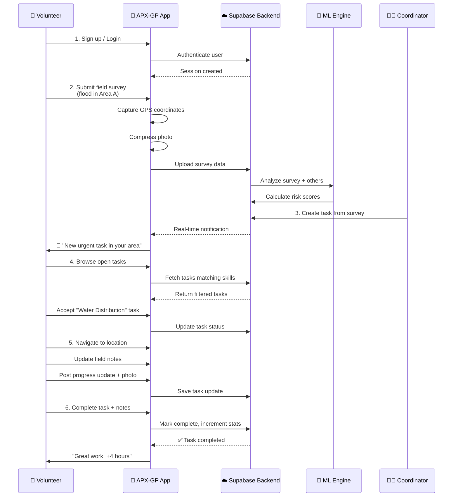
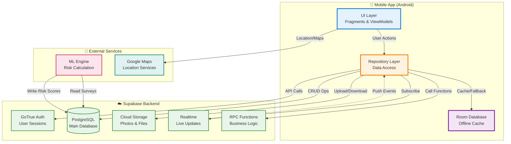
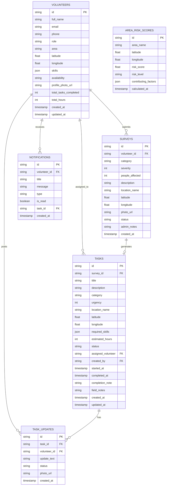
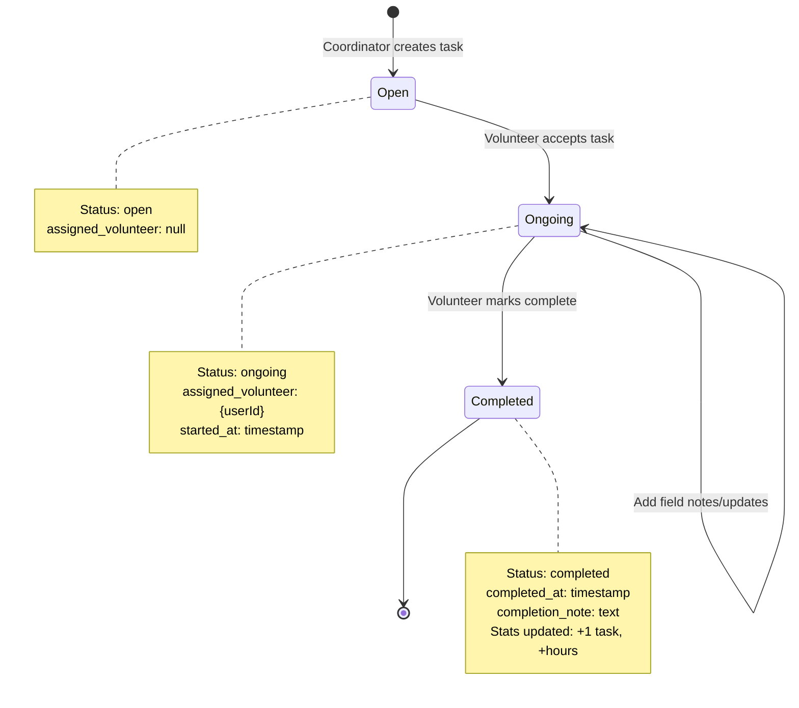
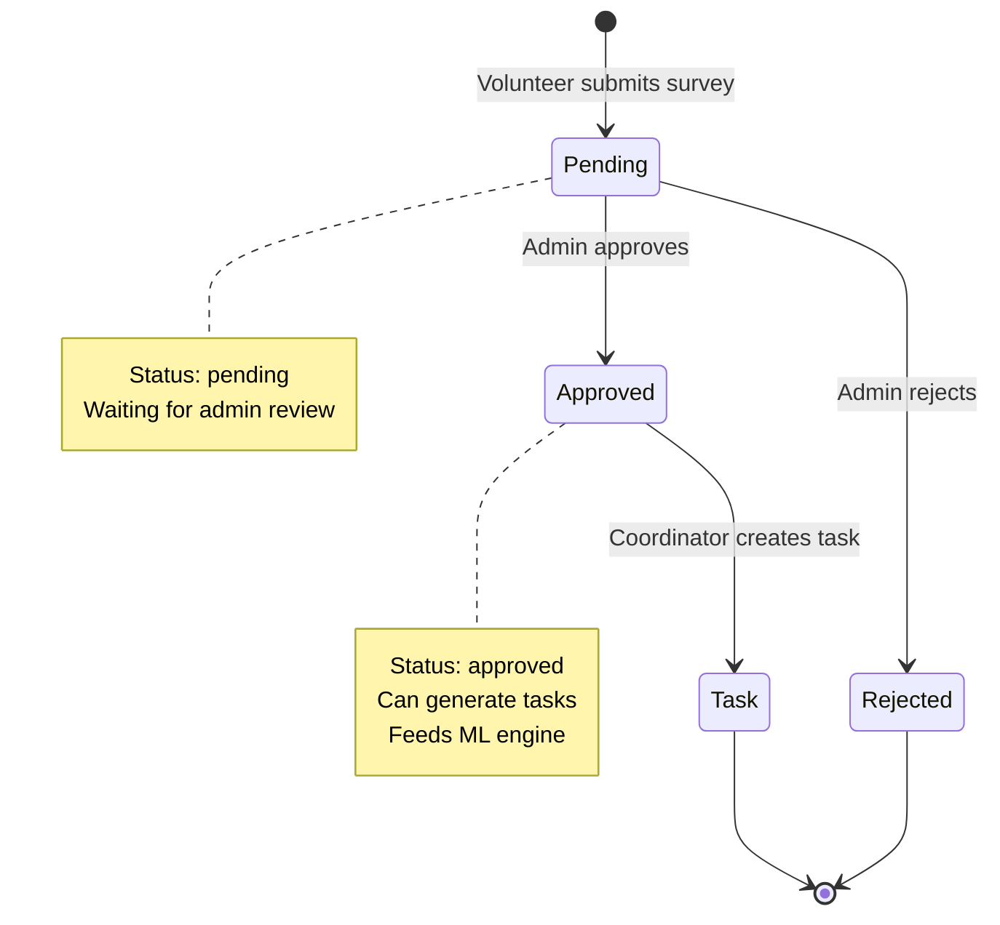
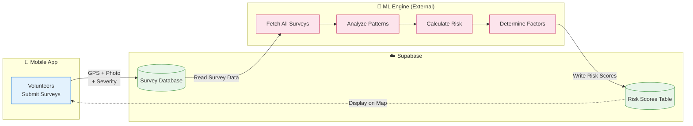

# 📱 APX-GP: Smart Resource Allocation & Volunteer Coordination Platform

> An intelligent mobile platform that connects volunteers with disaster relief tasks, enabling real-time field surveys, GPS-tagged reporting, and AI-powered risk assessment to help NGOs respond faster to community emergencies.

<p align="center">
  
  
  
  
  
  
</p>

---

## 🌟 What is APX-GP?

**APX-GP** (Advanced Planning & Execution - Ground Personnel) is a production-ready Android application designed for **NGO volunteers and disaster relief coordinators**. It solves the critical problem of coordinating emergency response by providing:

- 🚨 **Real-time Task Assignment**: Volunteers receive urgent disaster relief tasks based on their skills and location
- 📊 **Field Survey Collection**: GPS-tagged, photo-documented incident reports from the ground
- 🎯 **Smart Matching**: AI-powered system matches volunteers with appropriate tasks
- 📍 **Risk Mapping**: Machine learning analyzes survey data to identify high-risk areas
- 💪 **Offline Support**: Critical task information cached locally for areas with poor connectivity
- 🔔 **Live Updates**: Real-time notifications keep everyone synchronized

### The Problem We Solve

During disasters (floods, fires, medical emergencies), NGOs face:
- **Scattered Information**: Reports come from calls, texts, paper forms, and multiple apps
- **Slow Response**: Manual coordination delays volunteer deployment
- **Poor Visibility**: Coordinators can't see real-time status of volunteers and resources
- **Duplicate Work**: Multiple volunteers respond to the same incident
- **No Impact Tracking**: Hard to measure volunteer contributions

### Our Solution

APX-GP creates a **unified digital command center** where:
1. **Volunteers** submit geo-tagged field surveys with photos
2. **AI analyzes** severity and calculates area risk scores
3. **System creates tasks** based on urgent needs
4. **Volunteers accept tasks** matching their skills
5. **Everyone stays synchronized** with real-time updates
6. **Coordinators track** progress on a live dashboard

---

## 📸 Key Features at a Glance

| Feature | What It Does | Who Benefits |
|---------|-------------|--------------|
| 🔐 **Secure Authentication** | Email/password signup with automatic session management | All users stay secure |
| 📊 **Personalized Dashboard** | Shows active tasks, impact stats, urgent missions, recent surveys | Volunteers see their impact |
| 🎯 **Smart Task Management** | Browse, accept, and complete tasks with urgency indicators | Volunteers respond efficiently |
| 📝 **Field Survey Collection** | GPS auto-capture, photo upload, severity rating (1-5) | Ground truth data collection |
| 🔔 **Real-time Notifications** | Live updates on task assignments and status changes | Everyone stays informed |
| 👤 **Profile Management** | Skill tags, availability status, profile photos | Better volunteer matching |
| 🗺️ **Risk Map Dashboard** | AI-calculated risk scores visualized on interactive map | Coordinators prioritize areas |
| 📴 **Offline Mode** | Critical task data cached locally with Room database | Works in low-connectivity zones |

---

## 🎬 How It Works: A Volunteer's Journey



### Step-by-Step Breakdown

1. **Sign Up & Login** 🔐
   - Volunteer creates account with email, password, skills, and area
   - System remembers login (session persistence)
   - Automatic navigation to dashboard on next app open

2. **Submit Field Survey** 📝
   - Report incidents with category (flood/fire/medical/infrastructure)
   - Rate severity (1-5 slider)
   - App automatically captures GPS coordinates
   - Attach photo evidence (compressed to under 2MB)
   - Data sent to cloud for AI analysis

3. **AI Risk Analysis** 🤖
   - Machine learning analyzes all surveys in an area
   - Calculates risk scores (0-10) based on:
     - Number of reports
     - Severity ratings
     - People affected
     - Recent incident density
   - Generates risk level (Low/Medium/High/Critical)

4. **Task Creation & Assignment** 🎯
   - Coordinators create tasks from high-priority surveys
   - Tasks include: title, location, required skills, urgency, estimated hours
   - Volunteers see tasks matching their skills
   - Accept task → status changes to "ongoing"

5. **Task Execution** 💪
   - Volunteer navigates to location
   - Updates field notes during work
   - Posts progress updates with photos
   - Real-time updates visible to coordinators

6. **Completion & Impact** 🏆
   - Mark task complete with completion notes
   - Profile automatically updates:
     - Total tasks completed +1
     - Total hours += estimated hours
   - Notification sent to coordinator

---

## 🏗️ System Architecture

### High-Level Architecture Overview



### Architecture Layers Explained

#### 1️⃣ **UI Layer** (What You See)
- **Purpose**: User interface and interaction
- **Components**: 
  - Fragments (screens like LoginFragment, DashboardFragment, TaskListFragment)
  - ViewModels (manage screen data and business logic)
  - Adapters (display lists of tasks, notifications, surveys)
- **Technology**: Android Views with ViewBinding, Material Design 3
- **User Interaction**: Button clicks, form inputs, list scrolling

#### 2️⃣ **Repository Layer** (Data Management)
- **Purpose**: Abstracts where data comes from (cloud or local cache)
- **Components**:
  - `AuthRepository`: Login, signup, session management
  - `TaskRepository`: Task CRUD operations with offline caching
  - `SurveyRepository`: Survey submission and retrieval
  - `ProfileRepository`: User profile management
  - `NotificationRepository`: Notification fetching and read status
  - `RiskScoreRepository`: Risk data for ML bridge
- **Smart Caching**: 
  - ✅ Try fetching from cloud first
  - ❌ If network fails → use cached data from Room
  - 💾 Save successful cloud data to cache

#### 3️⃣ **Local Storage Layer** (Offline Support)
- **Purpose**: Store critical data locally for offline access
- **Technology**: Room Database (SQLite wrapper)
- **What's Cached**: Tasks (open, ongoing, completed)
- **Why Only Tasks?**: Most critical for field volunteers in low-connectivity areas

#### 4️⃣ **Supabase Backend** (Cloud Infrastructure)
- **PostgreSQL Database**: Stores all data (users, tasks, surveys, notifications)
- **GoTrue Auth**: Handles authentication with JWT tokens
- **Cloud Storage**: Stores survey photos and profile pictures
- **Realtime**: WebSocket connections for live updates
- **RPC Functions**: Server-side functions (e.g., increment task counter)

#### 5️⃣ **External Services**
- **ML Engine**: Python/external service that reads survey data, calculates risk scores
- **Google Maps**: Location services, GPS coordinates, map visualization

---

## 📊 Database Schema & Data Models

### Core Data Entities



### Data Model Descriptions

| Entity | Purpose | Key Information |
|--------|---------|-----------------|
| **Volunteers** | User profiles with skills and stats | Email, skills array, location, completion counts |
| **Surveys** | Field reports from volunteers | Category, severity (1-5), GPS, photo, status (pending/approved/rejected) |
| **Tasks** | Work assignments for volunteers | Urgency (1-5), required skills, status (open/ongoing/completed), field notes |
| **Task Updates** | Progress reports during task execution | Update text, optional photo, timestamp |
| **Notifications** | System alerts and messages | Type (task_assigned/completed/general), read status |
| **Area Risk Scores** | ML-calculated risk assessments | Risk score (0-10), level (low/medium/high/critical), contributing factors |

### Status Flow Diagrams

#### Task Lifecycle


#### Survey Workflow


---

## 🔧 Technology Stack

### Mobile Application Stack

| Layer | Technology | Purpose |
|-------|------------|---------|
| **Language** | Kotlin | Modern, safe, concise Android development |
| **Architecture** | MVVM (Model-View-ViewModel) | Separates UI from business logic for testability |
| **UI Framework** | Android Views + ViewBinding | Native Android UI with type-safe view access |
| **Design System** | Material Design 3 | Modern, accessible Google design guidelines |
| **Dependency Injection** | Hilt (Dagger) | Automatic dependency management |
| **Navigation** | Jetpack Navigation Component | Type-safe screen navigation |
| **Async** | Kotlin Coroutines + Flow | Non-blocking concurrent operations |
| **Local Database** | Room Database | SQLite wrapper for offline caching |
| **Networking** | Ktor Client | Modern HTTP client for Android |
| **Image Loading** | Glide | Efficient image loading and caching |
| **Location** | Google Play Services Location | GPS and location services |
| **Maps** | Google Maps Android SDK | Interactive map visualization |
| **Animations** | Lottie | Smooth JSON-based animations |

### Backend Infrastructure

| Component | Technology | Purpose |
|-----------|------------|---------|
| **Backend Platform** | Supabase | Open-source Firebase alternative |
| **Database** | PostgreSQL | Relational database with JSON support |
| **Authentication** | Supabase Auth (GoTrue) | JWT-based user authentication |
| **Storage** | Supabase Storage | S3-compatible object storage |
| **Realtime** | Supabase Realtime | WebSocket-based live updates |
| **Functions** | PostgreSQL RPC | Server-side business logic |
| **API Protocol** | REST (PostgREST) | Auto-generated RESTful API |

### Development Tools

| Tool | Purpose |
|------|---------|
| **IDE** | Android Studio Hedgehog+ | Official Android development environment |
| **Build System** | Gradle with Kotlin DSL | Dependency management and build automation |
| **Version Control** | Git | Source code versioning |
| **Testing** | JUnit, Mockk, Espresso | Unit, integration, and UI testing |
| **Code Quality** | Kotlin Lint | Static code analysis |

---

## 🚀 Getting Started

### Prerequisites

Before you begin, ensure you have:

- ✅ **Android Studio Hedgehog (2023.1.1) or newer**
- ✅ **JDK 17 or newer**
- ✅ **Android SDK with API 26+ (Android 8.0 Oreo)**
- ✅ **A Supabase account** (free tier works)
- ✅ **Google Maps API key** (free with billing enabled)
- ✅ **Physical Android device or emulator** (API 26+)

### Step 1: Clone the Repository

```bash
git clone https://github.com/yourusername/APX-GP-app.git
cd APX-GP-app
```

### Step 2: Set Up Supabase Backend

1. **Create a Supabase Project**
   - Go to [supabase.com](https://supabase.com)
   - Click "New Project"
   - Choose a name, database password, and region

2. **Execute Database Schema**
   - In Supabase Dashboard → SQL Editor
   - Run the `supabase_setup.sql` script (creates tables, RLS policies, functions)
   - Verify tables created: `volunteers`, `surveys`, `tasks`, `notifications`, etc.

3. **Create Storage Buckets**
   - Go to Storage section
   - Create buckets: `survey-photos` and `profile-photos`
   - Set both buckets to **public** access

4. **Get Your Credentials**
   - Go to Settings → API
   - Copy **Project URL** (e.g., `https://abcdefg.supabase.co`)
   - Copy **anon public** key (long JWT token)

### Step 3: Configure Local Properties

Create a `local.properties` file in the **project root directory**:

```properties
# Supabase Configuration
SUPABASE_URL=https://your-project-id.supabase.co
SUPABASE_ANON_KEY=your_anon_public_key_here

# Google Maps API Key
MAPS_API_KEY=your_google_maps_api_key_here
```

⚠️ **Security Note**: This file is git-ignored and never committed to version control

### Step 4: Get Google Maps API Key

1. Go to [Google Cloud Console](https://console.cloud.google.com)
2. Create a new project or select existing
3. Enable **Maps SDK for Android** and **Geocoding API**
4. Create credentials → API Key
5. Restrict key to Android apps (add your app's SHA-1 fingerprint)
6. Copy the API key to `local.properties`

### Step 5: Open in Android Studio

1. Launch Android Studio
2. Select **File → Open**
3. Navigate to the cloned project folder
4. Click **OK**
5. Wait for Gradle sync to complete (may take 2-5 minutes first time)

### Step 6: Run the Application

1. Connect an Android device (USB debugging enabled) OR start an emulator
2. Click the **Run** button (green play icon) or press **Shift+F10**
3. Select your target device
4. Wait for app to build and install

### Step 7: Test Core Features

1. **Sign Up**: Create a new volunteer account
2. **Submit Survey**: Report a test incident with photo and GPS
3. **View Dashboard**: Check your profile stats
4. **Browse Tasks**: See available tasks (create test tasks via Supabase dashboard)
5. **Accept Task**: Assign yourself to a task and add field notes
6. **Complete Task**: Mark task done and verify stats increment

---

## 📱 App Screens & User Interface

### 1. Authentication Flow

| Screen | Purpose | Key Elements |
|--------|---------|--------------|
| **Splash** | Auto-login check | App logo, loading indicator |
| **Login** | Sign in existing users | Email, password, "Login" button |
| **Signup** | New user registration | Name, email, password, phone, area, skills, availability |

### 2. Main Application Screens

| Screen | Purpose | Key Features |
|--------|---------|--------------|
| **Dashboard** | Home screen with overview | Greeting, task count, hours worked, active task card, urgent tasks list |
| **Task List** | Browse all tasks | Filter tabs (Open/Ongoing/Completed), task cards with urgency color |
| **Task Detail** | Full task information | Description, location, skills needed, field notes, updates, Accept/Complete buttons |
| **Survey Form** | Submit field reports | Category picker, severity slider, description, GPS button, photo picker |
| **Notifications** | View alerts | Notification list, unread badges, mark-as-read |
| **Profile** | Manage volunteer info | Profile photo, name, phone, skills chips, edit button |
| **Risk Map** | Visualize danger zones | Interactive map with color-coded markers (Low=Green, Critical=Red) |

### UI Design Principles

- 🎨 **Material Design 3**: Modern Google design language
- ♿ **Accessibility**: Large touch targets, high contrast, screen reader support
- 📱 **Responsive**: Adapts to different screen sizes
- 🌙 **Light Theme**: Clean, professional appearance (dark theme future roadmap)
- 🚨 **Color-Coded Urgency**: Red (Critical) → Orange (High) → Yellow (Medium) → Green (Low)

---

## 🧩 Project Structure

```
APX-GP-app/
├── app/
│   ├── src/
│   │   ├── main/
│   │   │   ├── java/com/yourname/sra/
│   │   │   │   ├── data/                    # Data layer
│   │   │   │   │   ├── local/               # Room database
│   │   │   │   │   │   ├── AppDatabase.kt   # Database definition
│   │   │   │   │   │   ├── TaskDao.kt       # Data access object
│   │   │   │   │   │   └── TaskEntity.kt    # Cached task model
│   │   │   │   │   ├── model/               # Data models
│   │   │   │   │   │   └── Models.kt        # Volunteer, Task, Survey, etc.
│   │   │   │   │   ├── remote/              # Remote data source
│   │   │   │   │   │   └── SupabaseClientProvider.kt
│   │   │   │   │   └── repository/          # Data repositories
│   │   │   │   │       ├── AuthRepository.kt
│   │   │   │   │       ├── TaskRepository.kt
│   │   │   │   │       ├── SurveyRepository.kt
│   │   │   │   │       ├── ProfileRepository.kt
│   │   │   │   │       ├── NotificationRepository.kt
│   │   │   │   │       ├── RiskScoreRepository.kt
│   │   │   │   │       └── MLBridgeRepository.kt
│   │   │   │   ├── di/                      # Dependency injection
│   │   │   │   │   └── AppModule.kt
│   │   │   │   ├── ui/                      # User interface
│   │   │   │   │   ├── auth/                # Login & Signup
│   │   │   │   │   ├── dashboard/           # Home screen
│   │   │   │   │   ├── tasks/               # Task management
│   │   │   │   │   ├── survey/              # Survey submission
│   │   │   │   │   ├── notifications/       # Notification list
│   │   │   │   │   ├── profile/             # User profile
│   │   │   │   │   └── risk/                # Risk map
│   │   │   │   ├── utils/                   # Utilities
│   │   │   │   │   ├── ImageUtils.kt        # Photo compression
│   │   │   │   │   └── Extensions.kt        # Helper functions
│   │   │   │   ├── MainActivity.kt          # Single activity
│   │   │   │   └── SRAApplication.kt        # Application class
│   │   │   ├── res/                         # Resources
│   │   │   │   ├── layout/                  # XML layouts
│   │   │   │   ├── navigation/              # Navigation graph
│   │   │   │   ├── values/                  # Strings, colors, themes
│   │   │   │   └── drawable/                # Icons and images
│   │   │   └── AndroidManifest.xml
│   │   └── test/                            # Unit tests
│   ├── build.gradle.kts                     # App dependencies
│   └── proguard-rules.pro                   # Code obfuscation
├── .kiro/                                   # Development specs
│   └── specs/hackathon-readiness-integration/
├── build.gradle.kts                         # Project config
├── settings.gradle.kts
├── local.properties                         # Local credentials (git-ignored)
└── README.md                                # This file
```

### Architecture Pattern: MVVM

```
┌─────────────────────────────────────────────────────┐
│                    UI Layer                         │
│  ┌─────────────┐        ┌─────────────┐           │
│  │  Fragment   │◄──────►│  ViewModel  │           │
│  │ (TaskList)  │ observe│ (TaskVM)    │           │
│  └─────────────┘  state └─────────────┘           │
└────────────────────┬───────────▲───────────────────┘
                     │           │
                     │ interact  │ return data
                     ▼           │
          ┌─────────────────────────────┐
          │    Repository Layer         │
          │  ┌───────────────────────┐  │
          │  │  TaskRepository       │  │
          │  │  - Supabase API       │  │
          │  │  - Room cache         │  │
          │  └───────────────────────┘  │
          └──────────┬──────────▲───────┘
                     │          │
          fetch data │          │ return
                     ▼          │
          ┌──────────────────────────────┐
          │     Data Sources             │
          │  ┌────────┐   ┌──────────┐  │
          │  │Supabase│   │Room DB   │  │
          │  │(Cloud) │   │(Local)   │  │
          │  └────────┘   └──────────┘  │
          └──────────────────────────────┘
```

**Benefits of MVVM**:
- ✅ **Separation of Concerns**: UI logic separate from business logic
- ✅ **Testability**: ViewModels can be unit tested without Android framework
- ✅ **Lifecycle Awareness**: ViewModels survive configuration changes
- ✅ **Reactive UI**: UI automatically updates when data changes

---

## 🤖 ML Bridge & AI Integration

### What is the ML Bridge?

The **ML Bridge** is a data access layer that allows external machine learning systems to:
1. **Read** survey data from the database
2. **Analyze** patterns (incident density, severity trends, affected populations)
3. **Calculate** risk scores for geographic areas
4. **Write** risk scores back to the database

### ML Workflow



### Risk Score Calculation Example

**Input**: 50 surveys from "Downtown Area"
- 10 flood reports (severity 4-5)
- 5 fire incidents (severity 3-4)
- 15 medical emergencies (severity 2-3)
- 20 infrastructure damage (severity 3-5)

**ML Analysis**:
- High incident density (50 reports in 7 days)
- Multiple high-severity events
- Geographic clustering around lat/lng (37.7749, -122.4194)
- 500+ people affected

**Output**: Area Risk Score
```json
{
  "area_name": "Downtown San Francisco",
  "latitude": 37.7749,
  "longitude": -122.4194,
  "risk_score": 8.5,
  "risk_level": "critical",
  "contributing_factors": [
    "high_incident_density",
    "multiple_flood_reports",
    "vulnerable_population",
    "infrastructure_damage"
  ],
  "calculated_at": "2026-06-06T10:30:00Z"
}
```

### Integration Points

| Repository Method | Purpose | ML Use Case |
|-------------------|---------|-------------|
| `SurveyRepository.getAllSurveys()` | Fetch all survey data | Training data for ML model |
| `RiskScoreRepository.saveRiskScore()` | Save single risk score | Testing/debugging |
| `RiskScoreRepository.saveRiskScores()` | Batch save risk scores | Production bulk writes |
| `RiskScoreRepository.clearOldScores()` | Delete previous calculations | Reset before new batch |

### Example ML Integration (Python Pseudocode)

```python
# External ML service connects to Supabase directly
from supabase import create_client
import pandas as pd

# Initialize client
supabase = create_client(SUPABASE_URL, SUPABASE_KEY)

# 1. Fetch survey data
surveys = supabase.table('surveys').select('*').execute()
df = pd.DataFrame(surveys.data)

# 2. Process with ML model
risk_scores = ml_model.calculate_area_risks(df)

# 3. Clear old scores
supabase.rpc('clear_risk_scores').execute()

# 4. Write new scores
for score in risk_scores:
    supabase.table('area_risk_scores').insert({
        'area_name': score['area'],
        'latitude': score['lat'],
        'longitude': score['lng'],
        'risk_score': score['score'],
        'risk_level': score['level'],
        'contributing_factors': score['factors']
    }).execute()
```

---

## 🔒 Security & Privacy

### Authentication Security

- 🔐 **Password Hashing**: Supabase Auth uses bcrypt with salting
- 🔑 **JWT Tokens**: Secure session tokens with expiration
- 🚫 **No Plain Text Storage**: Passwords never stored in plain text
- ⏰ **Session Expiration**: Automatic logout after inactivity
- 📱 **Device-Level Security**: Sessions stored in Android secure storage

### Data Privacy

- 🛡️ **Row Level Security (RLS)**: Database-level access control
- 👤 **User Data Isolation**: Volunteers only see their own data
- 📍 **Location Privacy**: GPS coordinates stored only with user consent
- 🖼️ **Image Privacy**: Photos uploaded to secure cloud storage
- ❌ **No Third-Party Tracking**: No analytics or ad tracking SDKs

### API Security

- 🔒 **HTTPS Only**: All network traffic encrypted with TLS 1.3
- 🎟️ **API Key Protection**: Keys stored in local.properties (git-ignored)
- 🚧 **Input Validation**: Server-side validation prevents injection attacks
- 🛑 **Rate Limiting**: Supabase protects against DDoS attacks
- 📝 **Audit Logs**: All data changes tracked with timestamps

### Best Practices

- ✅ Regular security updates for dependencies
- ✅ Code obfuscation in release builds (ProGuard)
- ✅ Secure credential management (no hardcoded secrets)
- ✅ Proper permission requests (location, camera, storage)
- ✅ Error messages don't leak sensitive information

---

## 🧪 Testing Strategy

### Unit Tests
- Repository layer logic
- ViewModel state management
- Data model conversions (Task ↔ TaskEntity)
- Utility functions (image compression, error mapping)

### Integration Tests
- Database operations (Room DAO queries)
- Supabase API calls (mock server responses)
- Repository caching behavior
- Navigation flows

### UI Tests (Espresso)
- Login and signup flows
- Task acceptance and completion
- Survey submission
- Navigation between screens

### Manual Testing Checklist

| Feature | Test Case | Expected Result |
|---------|-----------|-----------------|
| **Signup** | New user registration | Account created, auto-login to dashboard |
| **Login** | Existing user login | Session restored, navigate to dashboard |
| **Survey** | Submit with GPS and photo | Survey saved, photo compressed and uploaded |
| **Task Accept** | Accept open task | Status → ongoing, assigned to user |
| **Task Complete** | Mark task complete | Stats increment, completion note saved |
| **Offline Mode** | Disable network, view tasks | Cached tasks displayed with indicator |
| **Realtime** | Create task in Supabase | Notification appears in app instantly |
| **Profile Edit** | Update phone and skills | Changes saved and reflected immediately |

---

## 🐛 Troubleshooting

### Common Issues

<details>
<summary><strong>Build Error: "SUPABASE_URL not configured"</strong></summary>

**Solution**: Create `local.properties` file in project root with:
```properties
SUPABASE_URL=https://your-project-id.supabase.co
SUPABASE_ANON_KEY=your_anon_key
MAPS_API_KEY=your_maps_key
```
</details>

<details>
<summary><strong>App Crashes on Login</strong></summary>

**Possible Causes**:
1. Incorrect Supabase credentials
2. Supabase project paused (free tier limit)
3. Network connectivity issues

**Solution**: Check Supabase dashboard is online, verify credentials, test network connection
</details>

<details>
<summary><strong>GPS Not Working</strong></summary>

**Solution**: 
1. Enable location permissions in device settings
2. Turn on GPS/Location Services
3. Test on physical device (emulator GPS is unreliable)
4. Ensure `ACCESS_FINE_LOCATION` permission granted
</details>

<details>
<summary><strong>Photos Not Uploading</strong></summary>

**Solution**:
1. Check storage permission granted
2. Verify Supabase storage buckets created and set to public
3. Check image compression didn't fail (too large >2MB)
4. Review Supabase storage quota (free tier: 1GB)
</details>

<details>
<summary><strong>Tasks Not Appearing</strong></summary>

**Solution**:
1. Create test tasks in Supabase dashboard manually
2. Check RLS policies allow volunteer to read tasks
3. Verify network connection for API calls
4. Check Room database has cached data if offline
</details>

<details>
<summary><strong>Map Not Loading</strong></summary>

**Solution**:
1. Verify MAPS_API_KEY in local.properties
2. Enable Maps SDK for Android in Google Cloud Console
3. Add app SHA-1 fingerprint to API key restrictions
4. Check billing is enabled on Google Cloud project
</details>

---

## 📈 Performance Optimization

### Image Compression
- Photos automatically compressed to <2MB before upload
- Progressive quality reduction (100 → 10 in steps of 10)
- JPEG format for optimal compression ratio

### Offline Caching
- Tasks cached locally in Room database
- Automatic fallback when network unavailable
- Background sync when connection restored

### Lazy Loading
- Task lists paginated (load more on scroll)
- Images loaded on-demand with Glide caching
- Database queries optimized with indexes

### Battery Optimization
- Location updates only when survey form open
- Realtime subscriptions lifecycle-aware (pause when app backgrounded)
- Efficient coroutine usage (structured concurrency)

---

## 🚀 Future Roadmap

### Phase 1: Core Enhancements (Q3 2026)
- [ ] Dark mode theme support
- [ ] Multi-language support (Spanish, French, Hindi)
- [ ] Push notification service (FCM integration)
- [ ] Voice notes for task updates
- [ ] Offline-first architecture (full sync engine)

### Phase 2: Advanced Features (Q4 2026)
- [ ] In-app chat between volunteers and coordinators
- [ ] Route optimization for multiple tasks
- [ ] Volunteer leaderboard and badges
- [ ] Export personal impact report (PDF)
- [ ] QR code check-in at task locations

### Phase 3: ML & Analytics (2027)
- [ ] Predictive task assignment (recommend best volunteer)
- [ ] Demand forecasting (predict resource needs)
- [ ] Sentiment analysis on task feedback
- [ ] Heatmap animation (risk changes over time)
- [ ] Custom ML model training interface

### Phase 4: Platform Expansion (2027+)
- [ ] iOS application (Swift/SwiftUI)
- [ ] Web dashboard for coordinators (Flutter Web)
- [ ] Admin portal (React/Next.js)
- [ ] Public API for third-party integrations
- [ ] Blockchain audit trail for accountability

---

## 🤝 Contributing

We welcome contributions! Here's how you can help:

### Code Contributions
1. Fork the repository
2. Create a feature branch (`git checkout -b feature/amazing-feature`)
3. Commit your changes (`git commit -m 'Add amazing feature'`)
4. Push to the branch (`git push origin feature/amazing-feature`)
5. Open a Pull Request

### Code Style Guidelines
- Follow Kotlin coding conventions
- Use meaningful variable names
- Add KDoc comments for public functions
- Write unit tests for new features
- Ensure no lint warnings

### Bug Reports
- Use GitHub Issues
- Include: device model, Android version, steps to reproduce
- Attach screenshots or screen recordings if possible

### Feature Requests
- Open a GitHub Discussion
- Explain the problem it solves
- Describe expected behavior
- Provide mockups or examples if applicable

---

## 📜 License

This project is licensed under the **MIT License** - see the [LICENSE](LICENSE) file for details.

```
MIT License

Copyright (c) 2026 APX-GP Team

Permission is hereby granted, free of charge, to any person obtaining a copy
of this software and associated documentation files (the "Software"), to deal
in the Software without restriction, including without limitation the rights
to use, copy, modify, merge, publish, distribute, sublicense, and/or sell
copies of the Software, and to permit persons to whom the Software is
furnished to do so, subject to the following conditions:

The above copyright notice and this permission notice shall be included in all
copies or substantial portions of the Software.

THE SOFTWARE IS PROVIDED "AS IS", WITHOUT WARRANTY OF ANY KIND, EXPRESS OR
IMPLIED, INCLUDING BUT NOT LIMITED TO THE WARRANTIES OF MERCHANTABILITY,
FITNESS FOR A PARTICULAR PURPOSE AND NONINFRINGEMENT.
```

---

## 📞 Contact & Support

### Project Team
- **Lead Developer**: [Your Name](mailto:your.email@example.com)
- **Project Manager**: [PM Name](mailto:pm.email@example.com)
- **GitHub**: [github.com/yourusername/APX-GP-app](https://github.com/yourusername/APX-GP-app)

### Resources
- 📖 **Documentation**: [docs.apxgp.org](https://docs.apxgp.org)
- 💬 **Community Discord**: [discord.gg/apxgp](https://discord.gg/apxgp)
- 🐛 **Bug Reports**: [GitHub Issues](https://github.com/yourusername/APX-GP-app/issues)
- ✨ **Feature Requests**: [GitHub Discussions](https://github.com/yourusername/APX-GP-app/discussions)

### Related Projects
- **Web Dashboard**: [github.com/yourusername/APX-GP-web](https://github.com/yourusername/APX-GP-web)
- **ML Engine**: [github.com/yourusername/APX-GP-ml](https://github.com/yourusername/APX-GP-ml)
- **API Documentation**: [api.apxgp.org](https://api.apxgp.org)

---

## 🙏 Acknowledgments

Special thanks to:

- **Supabase Team** for the excellent open-source backend platform
- **Google Maps Platform** for location services and visualization
- **Kotlin Community** for continuous language improvements
- **Android Jetpack Team** for architecture components
- **All Contributors** who helped build this platform
- **NGO Partners** for valuable feedback and testing
- **Volunteers** who use this app to make a difference

---

## 📊 Project Stats

| Metric | Value |
|--------|-------|
| **Lines of Code** | ~15,000+ |
| **Kotlin Files** | 45+ |
| **Screens** | 12 |
| **Database Tables** | 6 |
| **API Endpoints** | 30+ |
| **Dependencies** | 25+ |
| **Min Android Version** | API 26 (Android 8.0) |
| **Target Android Version** | API 34 (Android 14) |

---

<div align="center">

### ⭐ If this project helps you, please give it a star! ⭐

**Made with ❤️ for disaster relief volunteers and NGOs worldwide**

[Report Bug](https://github.com/yourusername/APX-GP-app/issues) •
[Request Feature](https://github.com/yourusername/APX-GP-app/discussions) •
[Documentation](https://docs.apxgp.org) •
[Community](https://discord.gg/apxgp)

</div>
