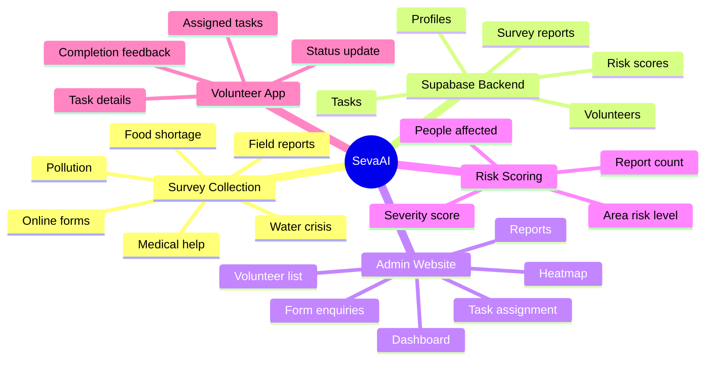
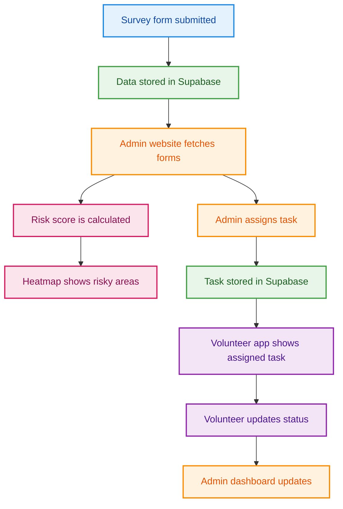
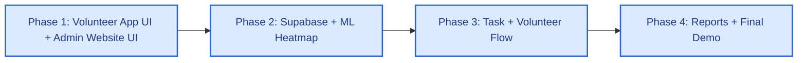
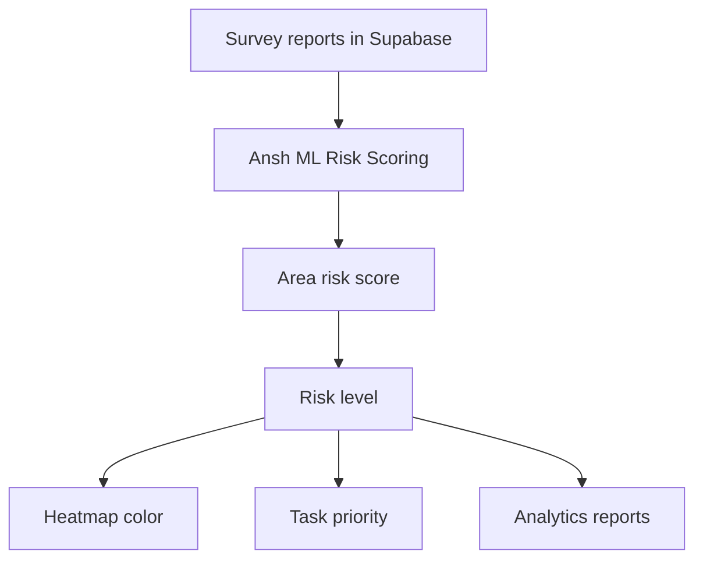
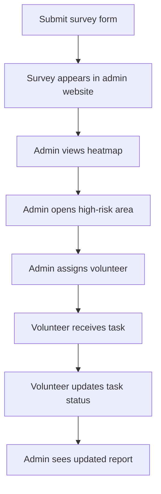

# SevaAI - Smart NGO Survey, Heatmap & Volunteer Coordination Platform

> A simple but powerful NGO management system where survey forms are collected, area problems are shown on a heatmap, and admins assign volunteers to solve real community issues.

<p align="center">
  
  
  
  
  
</p>

----

## Project In Simple Words

SevaAI is a platform for NGOs and social workers.

People fill survey forms about problems in their area, like water crisis, pollution, food shortage, medical help, education support, or sanitation issues. The admin website collects all these forms, shows the problem areas on a heatmap, and allows the admin to assign volunteers to solve those problems.

The volunteer app shows each volunteer their assigned work, location, priority, and task status.

In one line:

> SevaAI collects community problems, shows risky areas on a heatmap, and helps admins assign volunteers to solve them.

----

## Simple Example

| Survey Input | System Output |
| --- | --- |
| City: Jaipur | Admin sees Jaipur survey |
| Area: Mansarovar | Mansarovar appears on heatmap |
| Problem: Water Crisis | Problem category becomes Water Crisis |
| Severity: High | Area becomes high risk |
| People affected: 500 | Risk score increases |
| Admin assigns volunteer | Volunteer sees task in app |

---

## What We Are Building

| Part | Purpose |
| --- | --- |
| Admin Website | Admin views surveys, heatmap, volunteers, tasks, and reports |
| Volunteer App | Volunteers view assigned tasks and update task status |
| Supabase Backend | Stores forms, users, volunteers, tasks, and heatmap data |
| Risk Scoring Model | Calculates which areas are low, medium, high, or critical risk |
| Heatmap | Shows area-wise crisis visually on a map |

---

## Mind Map



---

## How The Project Works



---

## Tech Stack

| Layer | Technology |
| --- | --- |
| Admin Website | React + TypeScript + Vite |
| Admin UI | Ant Design |
| Volunteer App | React Native Expo or mobile-style React app |
| Database | Supabase PostgreSQL |
| Auth | Supabase Auth |
| File Upload | Supabase Storage |
| Realtime Updates | Supabase Realtime |
| Heatmap | React Leaflet + Leaflet |
| Charts | Recharts |
| Animation | Anime.js |
| Deployment | Vercel for admin website, Expo for volunteer app |

---

## Supabase Database Tables

| Table | What It Stores |
| --- | --- |
| `profiles` | Admin and volunteer user profiles |
| `survey_reports` | Survey form enquiries submitted by users/field workers |
| `volunteers` | Volunteer details, skills, location, and availability |
| `tasks` | Work assigned by admin to volunteers |
| `task_updates` | Status updates submitted by volunteers |
| `area_risk_scores` | Heatmap risk score for each area/problem |

### Important Fields

| Table | Main Fields |
| --- | --- |
| `survey_reports` | `id`, `city`, `area`, `problem_type`, `severity`, `description`, `people_affected`, `latitude`, `longitude`, `status`, `created_at` |
| `volunteers` | `id`, `full_name`, `skills`, `city`, `area`, `availability`, `phone` |
| `tasks` | `id`, `survey_report_id`, `volunteer_id`, `title`, `priority`, `status`, `assigned_at`, `completed_at` |
| `area_risk_scores` | `id`, `city`, `area`, `problem_type`, `risk_score`, `risk_level`, `latitude`, `longitude` |

---

## Low-Cost Risk Scoring Model

We are not building an expensive ML pipeline.

For this project timeline, we will use a lightweight risk scoring model.

```text
riskScore =
  severityScore * 0.5 +
  reportCountScore * 0.25 +
  peopleAffectedScore * 0.25
```

| Risk Score | Risk Level | Heatmap Color |
| --- | --- | --- |
| 0-25 | Low | Green |
| 26-50 | Medium | Yellow |
| 51-75 | High | Orange |
| 76-100 | Critical | Red |

This makes the project realistic, low-cost, and easy to complete within the deadline.

---

## Core Features

### Admin Website

| Feature | Priority |
| --- | --- |
| Login page | Must have |
| Dashboard overview | Must have |
| Survey enquiry table | Must have |
| Heatmap page | Must have |
| Volunteer list | Must have |
| Task assignment | Must have |
| Reports and analytics | Must have |
| Admin profile/settings | Good to have |

### Volunteer App

| Feature | Priority |
| --- | --- |
| Volunteer login | Must have |
| Assigned task list | Must have |
| Task details | Must have |
| Status update | Must have |
| Completion feedback | Good to have |
| Location/map view | Good to have |

---

## Project Timeline

The project is divided into 4 phases:

| Phase | Dates | Main Goal |
| --- | --- | --- |
| Phase 1 | UI-building phase | Build the volunteer app screens and admin website screens with dummy/mock data |
| Phase 2 | June 2 - June 13 | Complete Supabase, survey data flow, ML risk scoring, and heatmap |
| Phase 3 | June 14 - June 25 | Complete task assignment, volunteer app flow, and admin operations |
| Phase 4 | June 25 - July 5 | Complete reports, analytics, polish, testing, deployment, and demo |



---

## Phase 1 Work Summary

In Phase 1, the team only builds the basic app and website screens with dummy/mock data. This phase is for creating the visual foundation before Supabase and ML are connected.

| Member | Phase 1 Work | Output |
| --- | --- | --- |
| Aashita | Login page and NGO admin profile UI | Login screen, profile screen |
| Ankit | Heatmap UI research and map page skeleton | Basic map page with dummy points |
| Arora | Survey page UI and volunteer page UI | Survey table, volunteer table |
| Ansh | Task allocation and analytics UI skeleton | Task table, analytics cards |
| Anirudh | Supabase planning and database table design | Database plan ready |
| Arpit | Demo data planning | Sample city, area, survey, and volunteer data |
| Arhan | Flexible UI support for whichever module is blocked | Small UI fixes, reusable components |
| Abhay | Light documentation and testing checklist | Basic test cases and demo notes |

---

## Phase 2: Supabase + ML Heatmap

**Dates:** June 2 - June 13  
**Main goal:** By June 13, Supabase, survey data, ML risk scoring, and heatmap must be working.

This is the most important phase. If Supabase and ML heatmap are not complete by June 13, the whole project becomes risky.

### Phase 2 Day-Wise Plan

| Date | Focus | Owners | Output |
| --- | --- | --- | --- |
| June 2 | Finalize Supabase schema and project setup | Anirudh + Arpit | Supabase project and table plan ready |
| June 3 | Create tables and relationships | Anirudh + Arpit | Database tables ready |
| June 4 | Insert demo survey, volunteer, task, and area data | Arpit + Anirudh + Ananya | Supabase has test data |
| June 5 | Connect admin website to Supabase | Anirudh + Arpit + Abhay | Supabase client working in frontend |
| June 6 | Display survey enquiries from Supabase | Arora + Aashita | Admin can view survey forms |
| June 7 | Build first ML risk scoring function | Ansh + Arhaan | Risk score generated from survey data |
| June 8 | Save ML output into `area_risk_scores` | Ansh + Aashita | Risk scores stored in Supabase |
| June 9 | Build heatmap UI | Aashita + Ansh | Map renders risk locations |
| June 10 | Connect heatmap with ML risk scores | Ankit + Ansh | Heatmap shows calculated area risk |
| June 11 | Add filters, legends, and popups | Ankit + Arhaan + Abhay | Heatmap is demo-friendly |
| June 12 | Test full Supabase + ML + heatmap flow | Abhay + Arhan | Bugs identified and fixed |
| June 13 | Phase 2 freeze and internal demo | Everyone | Supabase + ML heatmap completed |

### Phase 2 Must-Have Deliverables

| Deliverable | Owner |
| --- | --- |
| Supabase project and database tables | Anirudh |
| Realistic survey and area data | Arpit |
| Admin login and protected layout | Aashita |
| Survey enquiry table connected to Supabase | Arora |
| ML risk scoring model | Ansh |
| Risk scores saved into Supabase | Ansh + Anirudh |
| Heatmap connected to risk scores | Ankit |
| Shared integration fixes | Arhan |
| Testing checklist and screenshots | Abhay |

---

## Phase 3: Task Flow + Volunteer App

| Member | Responsibility | Detailed Work | Final Output |
| --- | --- | --- | --- |
| Aashita | Admin shell polish | Improve dashboard layout, profile page, navigation, route guards, logout, and responsive behavior | Professional admin shell |
| Ankit | Heatmap actions and activity | Add heatmap popup action like Create Task From Area; build recent activity feed from Supabase | Heatmap supports admin decisions |
| Arora | Survey-to-task support | Add survey detail view, allow survey status update, link selected survey to task creation | Admin can inspect survey and convert it into a task |
| Ansh | Task intelligence and ML priority | Use ML output to suggest task priority and required volunteer skills; build task table, assign modal, task detail view | Admin can assign high-risk work to volunteers |
| Anirudh | Supabase task queries | Add task assignment relationships, volunteer task queries, task update queries, and realtime subscriptions if possible | Task data works across admin and volunteer app |
| Arpit | Task and volunteer demo data | Prepare realistic volunteer skills, availability, locations, task records, and matching examples | Task assignment demo feels realistic |
| Arhan | Volunteer app integration | Connect assigned task data between admin website and volunteer app; resolve merge conflicts | Volunteer can see assigned work |
| Abhay | End-to-end testing | Test survey to risk score to heatmap to task to volunteer status update | Complete operational flow tested |

### Phase 3 Date Plan

| Date Range | Work | Owners | Output |
| --- | --- | --- | --- |
| June 14 - June 16 | Task table, task creation, survey-to-task conversion | Ansh + Arora + Arhan | Admin can create task from survey |
| June 17 - June 19 | Volunteer app assigned task list and task details | Arhan + Abhay | Volunteer can view assigned tasks |
| June 20 - June 21 | Admin assigns volunteer to task | Ansh + Arora | Task assigned to selected volunteer |
| June 22 - June 23 | Volunteer updates task status | Arhan + Anirudh | Status saved to Supabase |
| June 24 | Admin sees volunteer progress | Ansh + Aashita | Task progress visible in admin dashboard |
| June 25 | Phase 3 integration demo | Everyone | Full survey-to-volunteer flow working |

---

## Phase 4: Reports + Final Demo

**Dates:** June 25 - July 5  
**Main goal:** Make the project presentation-ready with reports, analytics, final polish, deployment, and testing.

| Member | Responsibility | Detailed Work | Final Output |
| --- | --- | --- | --- |
| Aashita | UI final polish | Fix spacing, colors, typography, mobile responsiveness | Clean final UI |
| Ankit | Heatmap finalization | Add legends, filters, popup details, demo-ready data | Presentation-ready heatmap |
| Arora | Surveys/volunteers finalization | Add final filters, empty states, loading states | Stable survey and volunteer module |
| Ansh | ML reports and analytics | Build risk charts, task reports, completion metrics, ML explanation cards, and risk insight dashboard | Demo-ready ML analytics/report page |
| Anirudh | Final database and deployment support | Verify Supabase tables, policies, environment variables, and production data | Stable backend for final demo |
| Arpit | Demo data and risk results | Prepare realistic data for multiple cities, areas, problem types, and risk scores | Strong demo dataset for heatmap and reports |
| Arhan | Final integration and UI fixes | Help all modules connect smoothly; fix route issues, broken imports, and inconsistent UI components | Integrated final project |
| Abhay | Final QA and presentation help | Run manual tests, collect screenshots, help prepare demo script and final checklist | Clean final submission package |

### Phase 4 Date Plan

| Date Range | Work | Owners | Output |
| --- | --- | --- | --- |
| June 25 - June 27 | Reports and analytics dashboard | Ansh | Risk charts, task reports, completion metrics |
| June 28 - June 29 | Final heatmap polish | Ankit | Legends, popups, filters, clean map UI |
| June 30 | Survey and volunteer page polish | Arora | Stable tables, filters, loading states |
| July 1 | Admin UI polish | Aashita | Consistent final design |
| July 2 | Final database and env check | Anirudh | Stable Supabase setup |
| July 3 | Final demo data and screenshots | Arpit + Abhay | Strong presentation dataset |
| July 4 | Deployment and full testing | Arhan + Anirudh + Abhay | Deployed project and bug fixes |
| July 5 | Final presentation/demo | Everyone | Final submission ready |

---

## Ansh ML Module

Ansh owns the ML/risk intelligence part of the project.

| ML Part | Description |
| --- | --- |
| Input | Survey reports from Supabase |
| Fields Used | `city`, `area`, `problem_type`, `severity`, `people_affected`, `latitude`, `longitude` |
| Processing | Convert severity to score, count reports by area, calculate affected population score |
| Output | `risk_score`, `risk_level`, `heatmap_color`, `recommended_priority` |
| Used By | Heatmap, task priority, analytics, reports |

```text
severityScore:
Low = 25
Medium = 50
High = 75
Critical = 100

riskScore =
  severityScore * 0.45 +
  reportCountScore * 0.25 +
  peopleAffectedScore * 0.20 +
  problemTypeWeight * 0.10
```



---

## Team Folder Ownership

| Member | Folder Ownership |
| --- | --- |
| Aashita | `src/features/auth/`, `src/features/profile/`, `src/components/layout/` |
| Ankit | `src/features/heatmap/`, `src/features/activity/`, `src/components/maps/` |
| Arora | `src/features/surveys/`, `src/features/volunteers/` |
| Ansh | `src/features/ml/`, `src/features/tasks/`, `src/features/analytics/`, `src/features/reports/` |
| Anirudh | `src/services/supabaseClient.ts`, Supabase SQL/schema, database policies |
| Arpit | `src/utils/riskScoring.ts`, demo data, database seed records |
| Arhan | Shared UI components, integration fixes, route support |
| Abhay | `docs/`, QA checklist, screenshots, demo script |

---

## Git Branch Plan

| Member | Branch |
| --- | --- |
| Aashita | `feature/aashita-auth-profile-layout` |
| Ankit | `feature/ankit-heatmap-activity` |
| Arora | `feature/arora-surveys-volunteers` |
| Ansh | `feature/ansh-ml-tasks-analytics-reports` |
| Anirudh | `feature/anirudh-supabase-database` |
| Arpit | `feature/arpit-risk-data-support` |
| Arhan | `feature/arhan-integration-ui-support` |
| Abhay | `feature/abhay-testing-docs` |

---

## Final Demo Flow



---

## What To Avoid

| Avoid | Why |
| --- | --- |
| Expensive ML pipeline | Not needed for this deadline |
| Building full custom backend | Supabase is enough |
| Too many features | Will break the deadline |
| Over-animation | Admin tools must be clear and fast |
| No shared design system | Project will look inconsistent |
| Last-day integration | Highest risk of failure |

---

## Final Goal

By July 5, the project should clearly show:

- A survey form stores data in Supabase.
- Admin website displays submitted forms.
- Heatmap shows risky areas.
- Admin assigns tasks to volunteers.
- Volunteer app shows assigned work.
- Volunteer updates task status.
- Admin sees reports and analytics.

That is enough to demonstrate a complete, realistic, and understandable working system.
