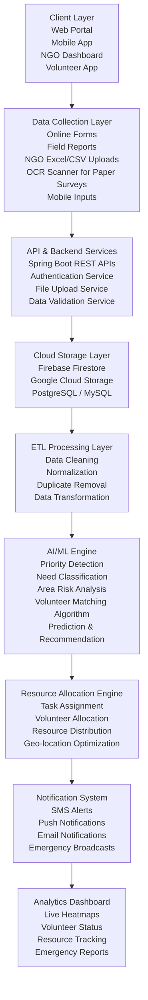
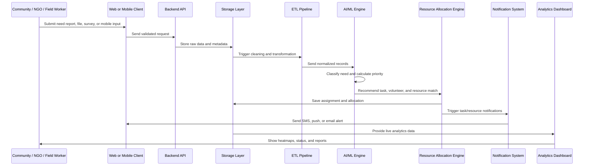
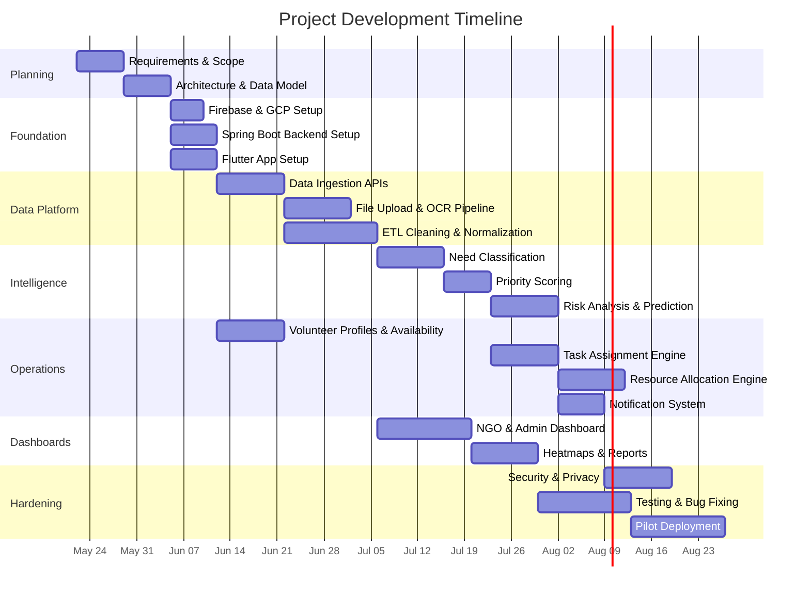

# Smart Resource Allocation & Volunteer Coordination Platform

## Overview

The Smart Resource Allocation & Volunteer Coordination Platform is an AI-assisted system designed to collect scattered community needs data, identify urgent problems, and match available volunteers and resources to the areas where they are needed most.

The platform supports NGOs, coordinators, volunteers, field workers, and administrators through mobile apps, dashboards, data ingestion tools, AI/ML analysis, resource allocation workflows, real-time notifications, and analytics.

## Problem Statement

Community support organizations often receive information from many disconnected sources such as paper surveys, field reports, phone calls, local NGO spreadsheets, mobile inputs, and emergency updates. This makes it difficult to:

- Identify the most urgent local needs.
- Remove duplicate or inconsistent reports.
- Understand which areas are at high risk.
- Assign the right volunteers to the right tasks.
- Track resource distribution transparently.
- Notify volunteers and coordinators in real time.
- Generate reliable reports for stakeholders.

This project solves that problem by building a unified platform that gathers, cleans, analyzes, prioritizes, and acts on community needs data.

## Objectives

- Collect community needs data from digital forms, field reports, paper surveys, mobile apps, and NGO spreadsheets.
- Store raw and processed data securely using Firebase, Google Cloud Storage, and relational databases.
- Clean, normalize, validate, and deduplicate incoming data through ETL pipelines.
- Use AI/ML to classify needs, detect urgency, analyze area-level risk, and predict future demand.
- Match volunteers to tasks using skill, availability, proximity, urgency, and workload.
- Allocate resources efficiently using geo-location and priority-based optimization.
- Notify users through SMS, email, push notifications, and emergency broadcasts.
- Provide live dashboards with heatmaps, reports, volunteer status, and resource tracking.
- Support scalability, offline-first mobile usage, security, privacy, and future expansion.

## Target Users

- Community members who submit needs or requests.
- Volunteers who accept and complete assigned tasks.
- Field coordinators who collect reports and manage local operations.
- NGOs that upload datasets and monitor program impact.
- Administrators who manage users, permissions, resources, and system configuration.
- Stakeholders who need reports, analytics, and evidence of impact.

## High-Level Architecture



## Detailed Layer Documentation

### 1. Client Layer

The client layer provides all user-facing interfaces.

#### Web Portal

Used by administrators, NGOs, coordinators, and stakeholders to access dashboards, reports, user management, and system-level operations.

#### Mobile App

Used by field teams and coordinators to submit needs, upload images, capture GPS location, and work in low-connectivity areas.

#### NGO Dashboard

Used by NGO teams to upload datasets, view analytics, manage volunteers, approve task matches, and monitor community-level needs.

#### Volunteer App

Used by volunteers to create profiles, tag skills, receive tasks, accept assignments, navigate to locations, and submit completion feedback.

### 2. Data Collection Layer

This layer collects data from multiple channels.

#### Online Forms

Structured forms for community needs such as food, water, medical help, education support, shelter, sanitation, or emergency assistance.

#### Field Reports

Reports submitted by coordinators or volunteers. These may include structured fields, unstructured notes, images, documents, and location details.

#### NGO Excel/CSV Uploads

Bulk uploads from existing NGO databases and spreadsheets. The system should validate schema, detect missing values, and map columns to a standard format.

#### OCR Scanner for Paper Surveys

Paper surveys are scanned and converted into digital text using OCR. The extracted data then moves into validation and cleaning.

#### Mobile Inputs

Real-time or offline-first submissions from field workers and volunteers using mobile devices.

### 3. API & Backend Services

The backend handles business logic, authentication, validation, file processing, and communication between clients and storage services.

#### Spring Boot REST APIs

Core APIs for users, needs, tasks, resources, volunteers, dashboards, reports, notifications, and admin functions.

#### Authentication Service

Handles login, registration, token validation, session management, and role-based access control.

Recommended authentication options:

- Firebase Authentication
- JWT-based Spring Security
- OAuth login for future expansion

#### File Upload Service

Handles CSV, Excel, image, document, and scanned survey uploads. Files are stored in Google Cloud Storage while metadata is stored in Firestore or SQL.

#### Data Validation Service

Validates required fields, location format, duplicate submissions, file type, file size, schema consistency, and suspicious input.

### 4. Cloud Storage Layer

This layer stores raw files, processed records, user profiles, tasks, and analytics-ready data.

#### Firebase Firestore

Recommended for real-time app data such as users, volunteers, tasks, task status, notifications, and dashboard updates.

#### Google Cloud Storage

Recommended for files such as scanned surveys, uploaded spreadsheets, images, reports, and exported documents.

#### PostgreSQL / MySQL

Recommended for structured relational data such as organizations, resources, audit logs, assignments, inventory, and reporting records.

#### BigQuery

Recommended for analytics, historical trend analysis, dashboard aggregation, and model training datasets.

### 5. ETL Processing Layer

The ETL layer converts messy incoming data into clean, unified, analysis-ready records.

#### Data Cleaning

- Remove invalid values.
- Standardize spelling and category names.
- Correct formatting issues.
- Handle missing fields.
- Validate phone numbers, addresses, and coordinates.

#### Normalization

- Convert all data sources into a common schema.
- Normalize need categories such as health, food, water, sanitation, education, shelter, and logistics.
- Normalize location information into village, ward, district, state, latitude, and longitude.

#### Duplicate Removal

- Detect duplicate reports from the same person, area, or time window.
- Use fuzzy matching for names, addresses, and descriptions.
- Merge duplicate records while preserving audit history.

#### Data Transformation

- Convert raw reports into structured need records.
- Generate severity scores.
- Extract keywords from text.
- Prepare data for AI/ML models and dashboards.

### 6. AI/ML Engine

The AI/ML engine helps the system understand needs, prioritize urgency, and recommend actions.

#### Priority Detection

Calculates urgency based on:

- Severity of the issue.
- Number of affected people.
- Frequency of similar reports.
- Vulnerability of the population.
- Time sensitivity.
- Resource availability.

#### Need Classification

Classifies reports into categories such as:

- Health
- Food security
- Clean water
- Sanitation
- Education
- Shelter
- Logistics
- Emergency support

#### Area Risk Analysis

Identifies high-risk areas using:

- Historical needs data.
- Current report volume.
- Seasonal patterns.
- Population density.
- Resource shortage trends.
- Emergency signals.

#### Volunteer Matching Algorithm

Matches volunteers to tasks based on:

- Skills
- Availability
- Distance from task location
- Task urgency
- Language
- Past experience
- Current workload
- Safety constraints

#### Prediction & Recommendation

Predicts future needs and recommends:

- Where resources may be required next.
- Which areas need proactive attention.
- Which resources should be stocked.
- Which volunteers should be scheduled.
- Which tasks should be escalated.

### 7. Resource Allocation Engine

This layer turns insights into action.

#### Task Assignment

Creates tasks from validated community needs and assigns them to volunteers, coordinators, or NGO teams.

#### Volunteer Allocation

Allocates volunteers based on suitability score, travel distance, workload balance, availability, and urgency.

#### Resource Distribution

Tracks inventory and distributes resources such as food kits, medicines, hygiene kits, educational material, water supply, and emergency items.

#### Geo-location Optimization

Uses location data to reduce travel time, group nearby tasks, and improve response speed.

### 8. Notification System

The notification layer keeps users informed in real time.

#### SMS Alerts

Used for urgent messages, low-connectivity users, and people without smartphones.

#### Push Notifications

Used in volunteer and coordinator apps for task alerts, status updates, reminders, and emergency broadcasts.

#### Email Notifications

Used for reports, admin alerts, stakeholder communication, and summary updates.

#### Emergency Broadcasts

Used to alert multiple users in a target location during floods, fires, disease outbreaks, food shortages, or other urgent situations.

### 9. Analytics Dashboard

The analytics dashboard gives decision-makers a live view of the system.

#### Live Heatmaps

Shows urgent needs by location and category.

#### Volunteer Status

Tracks available, assigned, busy, inactive, and completed-task volunteers.

#### Resource Tracking

Shows available stock, distributed resources, pending requests, shortages, and delivery status.

#### Emergency Reports

Generates reports for crisis response, NGO planning, donors, government collaboration, and internal review.

## Application Features

### Volunteer App Features

- Profile creation.
- Skill tagging.
- Availability management.
- GPS-based location sharing.
- Task notifications.
- Task acceptance or rejection.
- Navigation to assigned locations.
- Task progress updates.
- Completion proof upload.
- Feedback submission after task completion.

### Coordinator App Features

- Upload community needs data.
- Submit field reports.
- View dashboards and analytics.
- Approve or adjust volunteer-task matches.
- Manage local resources.
- Generate reports for stakeholders.
- Monitor emergency alerts.

### Admin Dashboard Features

- User management.
- NGO management.
- Role-based access control.
- Data source management.
- Task monitoring.
- Resource inventory control.
- AI model configuration.
- Audit logs.
- Security settings.

### NGO Dashboard Features

- Upload Excel/CSV datasets.
- View need trends.
- Track volunteer participation.
- Monitor resource distribution.
- Export reports.
- Approve high-priority actions.

## Security & Privacy

- Use Firebase Authentication for secure login through email, phone, or social providers.
- Implement role-based access control for volunteers, coordinators, NGO users, and admins.
- Encrypt sensitive data using Google Cloud KMS.
- Use HTTPS for all client-server communication.
- Store passwords only through secure authentication providers.
- Apply least-privilege access for services and users.
- Maintain audit logs for sensitive operations.
- Validate uploaded files before processing.
- Protect personal data such as phone numbers, addresses, health-related reports, and GPS locations.
- Follow applicable local data protection laws.

## Scalability & Reliability

- Deploy backend services on Google Cloud Functions or Cloud Run for scalable workloads.
- Use Firebase Realtime Database or Firestore listeners for instant updates.
- Implement offline-first Flutter capabilities for poor-connectivity areas.
- Use retry queues for failed notifications, uploads, and processing jobs.
- Use Google Cloud Monitoring and Logging for system health tracking.
- Add automated backups for databases and storage buckets.
- Use CI/CD pipelines for reliable deployments.

## AI-Powered Enhancements

- Chatbot assistant for volunteers and coordinators using Dialogflow, Vertex AI, or another AI assistant framework.
- Predictive analytics for resource shortages.
- Sentiment analysis on community feedback.
- Smart scheduling to avoid volunteer burnout.
- Multilingual report understanding.
- AI-driven fundraising recommendations.
- Automatic summarization of field reports.

## Future Extensions

- Government open data portal integration.
- Blockchain-based transparency for resource distribution.
- AI-driven fundraising recommendations.
- Multi-language support for diverse communities.
- IoT integration for real-time environmental or supply monitoring.
- Public transparency dashboard for non-sensitive aggregated data.

## Recommended Technology Stack

| Layer | Recommended Technologies |
| --- | --- |
| Frontend | Flutter, Flutter Web |
| Backend | Spring Boot REST APIs, Firebase Functions, Google Cloud Functions |
| Authentication | Firebase Auth, Spring Security, JWT |
| Database | Firestore, PostgreSQL, MySQL |
| Analytics | BigQuery, Looker Studio, custom dashboard |
| File Storage | Google Cloud Storage |
| AI/ML | Google Cloud AI APIs, TensorFlow, Vertex AI |
| Notifications | Firebase Cloud Messaging, SMS Gateway, Email Service |
| Maps & Location | Google Maps API, Geolocation APIs |
| DevOps | GitHub Actions, Docker, Google Cloud Platform |
| Monitoring | Google Cloud Monitoring, Cloud Logging |
| Security | Firebase Auth, Google Cloud KMS, IAM |

## Core Data Entities

### User

- userId
- name
- phone
- email
- role
- organizationId
- location
- status
- createdAt

### Volunteer

- volunteerId
- userId
- skills
- availability
- currentLocation
- preferredAreas
- assignedTasks
- completedTasks
- rating
- workloadStatus

### Need Report

- reportId
- sourceType
- submittedBy
- category
- description
- location
- severity
- affectedPeople
- attachments
- validationStatus
- priorityScore
- createdAt

### Task

- taskId
- needReportId
- taskType
- priority
- assignedVolunteerId
- status
- location
- requiredSkills
- deadline
- completionProof
- feedback

### Resource

- resourceId
- name
- category
- quantityAvailable
- quantityAllocated
- storageLocation
- expiryDate
- status

### Notification

- notificationId
- recipientId
- channel
- title
- message
- status
- sentAt

## Data Flow



## System Architecture With Services

```mermaid
flowchart LR
    subgraph Clients["Client Applications"]
        Web["Web Portal"]
        Mobile["Flutter Mobile App"]
        NGO["NGO Dashboard"]
        Volunteer["Volunteer App"]
    end

    subgraph Gateway["API & Access"]
        API["Spring Boot REST API"]
        Auth["Authentication Service"]
        Upload["File Upload Service"]
        Validation["Data Validation Service"]
    end

    subgraph Storage["Storage & Data"]
        Firestore["Firebase Firestore"]
        GCS["Google Cloud Storage"]
        SQL["PostgreSQL / MySQL"]
        BigQuery["BigQuery"]
    end

    subgraph Processing["Processing"]
        OCR["OCR Processing"]
        ETL["ETL Pipeline"]
        Dedup["Duplicate Detection"]
        Normalize["Normalization"]
    end

    subgraph Intelligence["AI/ML Engine"]
        NLP["NLP Need Extraction"]
        Classifier["Need Classification"]
        Priority["Priority Scoring"]
        Risk["Area Risk Analysis"]
        Matching["Volunteer Matching"]
        Predict["Prediction & Recommendation"]
    end

    subgraph Operations["Operations"]
        Tasks["Task Assignment"]
        Resources["Resource Distribution"]
        Geo["Geo Optimization"]
        Notifications["SMS / Push / Email"]
    end

    subgraph Insights["Analytics"]
        Heatmaps["Live Heatmaps"]
        Reports["Emergency Reports"]
        Tracking["Volunteer & Resource Tracking"]
    end

    Web --> API
    Mobile --> API
    NGO --> API
    Volunteer --> API

    API --> Auth
    API --> Upload
    API --> Validation

    Upload --> GCS
    Validation --> Firestore
    Validation --> SQL

    GCS --> OCR
    Firestore --> ETL
    SQL --> ETL
    OCR --> ETL
    ETL --> Dedup
    Dedup --> Normalize
    Normalize --> BigQuery
    Normalize --> NLP

    NLP --> Classifier
    Classifier --> Priority
    Priority --> Risk
    Risk --> Matching
    Predict --> Matching

    Matching --> Tasks
    Tasks --> Resources
    Resources --> Geo
    Geo --> Notifications

    BigQuery --> Heatmaps
    Firestore --> Tracking
    SQL --> Reports
```



## Project Roadmap

### Phase 1: Foundation & Planning

- Define users, roles, and permissions.
- Finalize core modules and database schema.
- Prepare UI wireframes for web, NGO dashboard, volunteer app, and coordinator app.
- Set up GitHub repository and branching strategy.
- Configure Firebase project and Google Cloud project.
- Create initial Spring Boot backend structure.
- Create Flutter app structure.

### Phase 2: Data Ingestion & Storage

- Build online forms for needs submission.
- Build CSV/Excel upload module.
- Add file upload support for images and paper survey scans.
- Store files in Google Cloud Storage.
- Store metadata in Firestore or SQL.
- Add validation rules for required fields and supported file formats.
- Create standard schema for community needs.

### Phase 3: ETL & Data Quality

- Build ETL jobs for cleaning and normalization.
- Add duplicate detection.
- Add category mapping.
- Add location normalization.
- Add audit trail for data changes.
- Prepare analytics-ready tables.

### Phase 4: AI/ML Analysis

- Add NLP extraction for unstructured field reports.
- Build need classification model or API integration.
- Build priority scoring model.
- Add risk analysis by area.
- Add prediction model for future needs and resource shortages.
- Evaluate model accuracy using test datasets.

### Phase 5: Volunteer Coordination

- Build volunteer profile module.
- Add skill tagging and availability management.
- Add GPS-based location support.
- Build task creation and assignment system.
- Add volunteer-task matching algorithm.
- Allow coordinators to approve or adjust recommendations.
- Add task status updates and completion feedback.

### Phase 6: Resource Allocation

- Build resource inventory module.
- Track available, allocated, delivered, and exhausted resources.
- Link resources to need reports and tasks.
- Add geo-location optimization for delivery planning.
- Add shortage alerts.

### Phase 7: Notifications

- Configure Firebase Cloud Messaging.
- Add push notification support.
- Add SMS gateway integration.
- Add email notification service.
- Build emergency broadcast module.
- Add retry handling for failed notifications.

### Phase 8: Dashboards & Analytics

- Build admin dashboard.
- Build NGO dashboard.
- Add live heatmaps.
- Add volunteer status charts.
- Add resource tracking charts.
- Add emergency report generation.
- Add BigQuery integration for analytics.

### Phase 9: Security, Privacy & Compliance

- Add Firebase Authentication.
- Add role-based access control.
- Add encryption for sensitive fields.
- Configure Google Cloud KMS.
- Add audit logs.
- Add privacy controls for location and personal data.
- Review local data protection compliance.

### Phase 10: Testing & Deployment

- Write unit tests for backend services.
- Write integration tests for API flows.
- Test Flutter mobile and web UI.
- Perform security testing.
- Run pilot testing with selected NGOs and volunteers.
- Set up CI/CD using GitHub Actions.
- Deploy backend to Google Cloud.
- Deploy web app to Firebase Hosting.
- Roll out in phases: pilot, regional, national.

## Timeline



## Suggested Repository Structure

```text
smart-resource-allocation-platform/
├── backend/
│   ├── src/main/java/
│   ├── src/main/resources/
│   ├── src/test/
│   └── pom.xml
├── mobile_app/
│   ├── lib/
│   ├── test/
│   └── pubspec.yaml
├── web_dashboard/
│   ├── lib/
│   ├── web/
│   └── pubspec.yaml
├── ml_engine/
│   ├── notebooks/
│   ├── models/
│   ├── pipelines/
│   └── requirements.txt
├── cloud_functions/
│   ├── notifications/
│   ├── file_processing/
│   └── etl_triggers/
├── docs/
│   ├── architecture.md
│   ├── api-specification.md
│   ├── database-schema.md
│   └── deployment-guide.md
├── diagrams/
│   └── architecture.mmd
├── .github/workflows/
│   └── ci-cd.yml
└── README.md
```

## API Modules

### Authentication APIs

- Register user
- Login user
- Refresh token
- Logout user
- Get current profile
- Update role and permissions

### Need Report APIs

- Create need report
- Upload report attachment
- Get reports by location
- Get reports by category
- Validate report
- Mark duplicate report
- Update priority score

### Volunteer APIs

- Create volunteer profile
- Update skills
- Update availability
- Update location
- Get assigned tasks
- Accept or reject task
- Submit task feedback

### Task APIs

- Create task
- Assign task
- Reassign task
- Update task status
- Upload completion proof
- Close task

### Resource APIs

- Add resource
- Update inventory
- Allocate resource
- Track delivery
- Mark shortage
- Generate inventory report

### Dashboard APIs

- Get heatmap data
- Get volunteer availability summary
- Get resource summary
- Get emergency reports
- Get prediction insights

## Matching Score Example

A simple initial volunteer matching score can be calculated as:

```text
matchingScore =
  skillMatchScore * 0.35 +
  distanceScore * 0.25 +
  availabilityScore * 0.20 +
  urgencyScore * 0.10 +
  workloadBalanceScore * 0.10
```

The algorithm can later be improved using historical completion data, volunteer reliability, safety constraints, and feedback ratings.

## Required Skills For Team Members

### Core Technical Skills

- Programming languages: Java, Python, JavaScript, or Dart.
- Data structures and algorithms.
- Git and GitHub.
- REST API integration.
- SQL and NoSQL databases.
- Frontend development with Flutter.
- Backend development with Spring Boot.
- Cloud platforms, especially Google Cloud Platform.
- DevOps and CI/CD using GitHub Actions.
- Testing with unit, integration, and automated UI tests.

### Supporting Skills

- Software architecture.
- Security best practices.
- Documentation.
- Agile project management.
- Communication with non-technical stakeholders.
- Debugging and troubleshooting.

### Advanced Skills

- Machine learning and AI integration.
- NLP for text understanding.
- Serverless computing.
- Geo-spatial optimization.
- Data analytics and visualization.
- Blockchain or public audit trail design for future transparency.

## Minimum Viable Product

The MVP should include:

- User authentication.
- Volunteer and coordinator roles.
- Need report submission.
- CSV/Excel upload.
- Basic validation and storage.
- Simple priority scoring.
- Volunteer profile and availability.
- Basic task assignment.
- Push notifications.
- NGO/admin dashboard.
- Heatmap or location-based need view.
- Basic reports.

## Success Metrics

- Reduction in time taken to identify urgent needs.
- Increase in successful volunteer-task matches.
- Reduction in duplicate reports.
- Faster resource delivery time.
- Higher volunteer participation rate.
- Improved visibility for NGOs and coordinators.
- Accurate prediction of resource shortages.
- Reliable dashboard usage during emergency response.

## Deployment Strategy

1. Local development using Firebase emulator, local Spring Boot server, and Flutter debug builds.
2. Staging environment on Google Cloud for integration testing.
3. Pilot deployment with selected NGOs and volunteer groups.
4. Regional deployment after feedback and bug fixes.
5. National or large-scale deployment with monitoring, backups, and support processes.

## Conclusion

This platform combines data collection, cloud storage, ETL processing, AI/ML intelligence, volunteer coordination, resource allocation, notifications, and analytics into one connected system. Its main purpose is to help NGOs and community organizations respond faster, allocate resources more fairly, and make decisions based on reliable real-time data.

