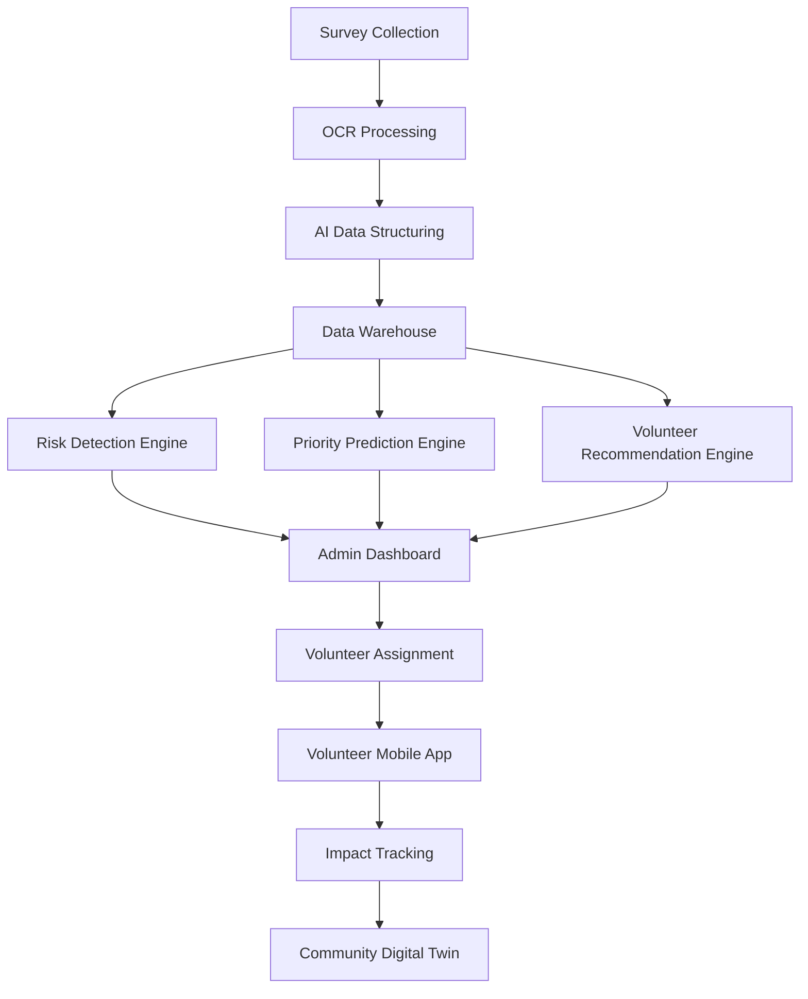
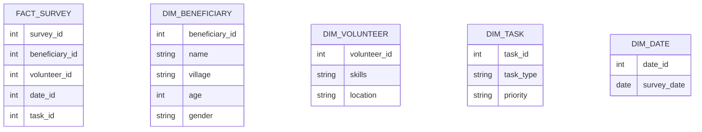
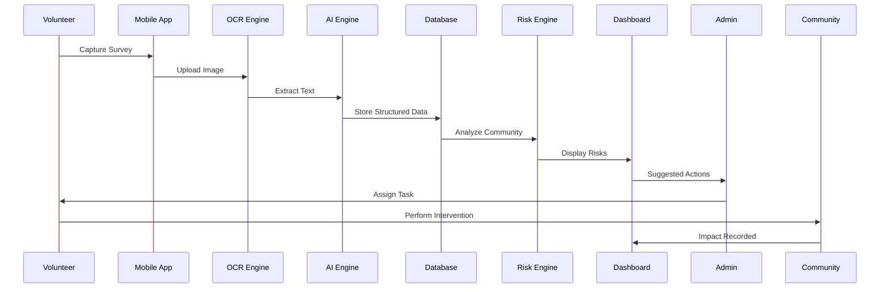

<p align="center">
  
</p>

<div align="center">


<p align="center">
  
</p>

</div>

---

# 📌 Problem Statement

Thousands of NGOs across India still rely on:

* Paper-based surveys
* Manual data entry
* Spreadsheet management
* Delayed decision making
* Inefficient volunteer allocation

 This results in:

❌ Lost data

❌ Delayed interventions

❌ Resource wastage

❌ Poor visibility into community needs

❌ Difficulty identifying high-priority beneficiaries

---

# 💡 Solution

SevaAI is an AI-powered Social Impact Intelligence Platform that digitizes survey data, analyzes community needs, predicts risks, and intelligently assigns volunteers to maximize social impact.

Instead of merely storing survey information, SevaAI converts raw field data into actionable intelligence.

---

# 🚀 Key Features

## 📄 Intelligent Survey Digitization

* Paper Survey Scanning
* Mobile Camera Capture
* OCR Extraction
* AI-Based Data Cleaning
* Structured Data Generation

---

## 🤖 AI Data Structuring Engine

Converts unstructured survey responses into machine-readable records.

Example:

Input:

Child has not attended school for four months because father migrated.

Output:

```json
{
  "school_dropout": true,
  "duration": "4 months",
  "reason": "migration"
}
```

---

## 🏥 Community Risk Detection

Automatically identifies:

* School Dropout Risk
* Healthcare Risk
* Malnutrition Risk
* Employment Risk
* Disability Support Needs

---

## 🎯 Priority Prediction Engine

Ranks beneficiaries based on urgency.

Priority Levels:

* Critical
* High
* Medium
* Low

---

## 👥 Volunteer Recommendation System

Matches volunteers using:

* Skills
* Experience
* Availability
* Language
* Distance
* Historical Performance

Output:

```text
Volunteer A : 94%
Volunteer B : 82%
Volunteer C : 71%
```

---

## 📊 Impact Analytics Dashboard

Provides:

* Survey Insights
* Community Statistics
* Volunteer Performance
* Intervention Outcomes
* Risk Heatmaps

---

## 🗺️ GIS Risk Mapping

Visualizes vulnerable communities geographically.

* High Risk Areas
* Medium Risk Areas
* Low Risk Areas

---

## 🧠 AI Survey Summarization

Converts hundreds of survey records into concise reports.

Example:

```text
32 children are currently out of school.

14 families require urgent medical support.

8 villages show high malnutrition indicators.
```

---

## 🏘️ Community Digital Twin

Creates a digital representation of communities.

Predicts:

* Future Risks
* Volunteer Demand
* Healthcare Requirements
* Educational Challenges

---

# 🏗️ System Architecture



---

# 📱 Platform Components

## Admin Portal

Features:

* Dashboard
* Survey Analytics
* Volunteer Management
* Risk Monitoring
* Intervention Tracking
* AI Copilot

---

## Volunteer Application

Features:

* Volunteer Registration
* Profile Management
* Task Assignment
* Task Completion
* Survey Submission
* Notifications

---

# 🧩 Technology Stack

| Layer            | Technology             |
| ---------------- | ---------------------- |
| Frontend Web     | React.js               |
| Mobile App       | Flutter                |
| Backend API      | FastAPI                |
| OCR Engine       | PaddleOCR              |
| Image Processing | OpenCV                 |
| AI Models        | Scikit-Learn           |
| LLM Layer        | Gemini / Llama         |
| Database         | PostgreSQL             |
| Data Warehouse   | PostgreSQL Star Schema |
| Analytics        | Power BI               |
| Maps             | Leaflet.js             |
| Containerization | Docker                 |
| Version Control  | Git & GitHub           |

---

# 🗄️ Data Warehouse Design

## Star Schema



---

# 🤖 AI Modules

## Module 1

OCR + Data Extraction

Tools:

* PaddleOCR
* OpenCV

---

## Module 2

Data Structuring Engine

Tasks:

* Entity Extraction
* Data Validation
* Duplicate Detection

---

## Module 3

Volunteer Recommendation System

Models:

* Random Forest
* XGBoost
* Cosine Similarity Matching

---

## Module 4

Priority Prediction Engine

Predicts:

* Urgency
* Resource Allocation Needs

---

## Module 5

Community Risk Detection

Detects:

* Dropout Risk
* Malnutrition Risk
* Healthcare Vulnerability

---

## Module 6

AI Copilot

Natural Language Queries:

Examples:

```text
Which village needs immediate attention?

Show dropout trends.

Which volunteer performed best this month?
```

---

# 🔄 End-to-End Workflow



---

# 🎯 Expected Impact

### NGOs

* Faster decision making
* Better volunteer utilization
* Reduced manual effort

### Communities

* Faster intervention
* Better support targeting
* Improved service delivery

### Government & Organizations

* Data-driven planning
* Community intelligence
* Predictive social welfare analytics

---

# 📈 Future Roadmap

## Phase 1
* Admin Dashboard
* Volunteer App

## Phase 2

* Recommendation Engine
* Priority Prediction
* OCR Pipeline
* database

## Phase 3
* Risk Detection
* AI Copilot
* GIS Mapping
* Community Digital Twin

## Phase 4

* State-Level Deployment
* Government Integration
* Multi-NGO Collaboration Network

---

# 🌟 Vision

SevaAI aims to become the operating system for social impact organizations, enabling NGOs, governments, and community workers to make faster, smarter, and more impactful decisions through Artificial Intelligence.

> From Paper Surveys to Predictive Social Intelligence.
