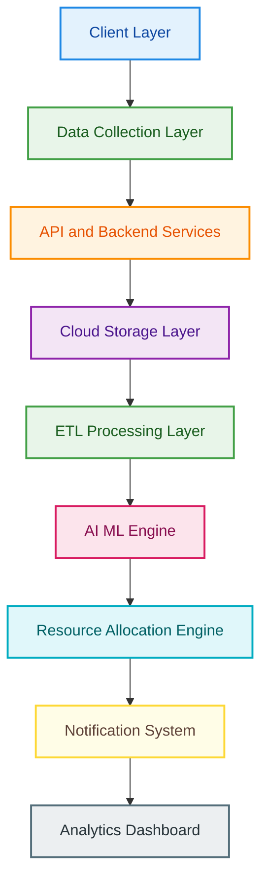
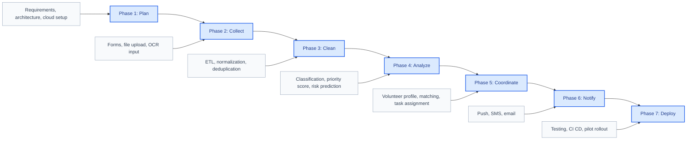
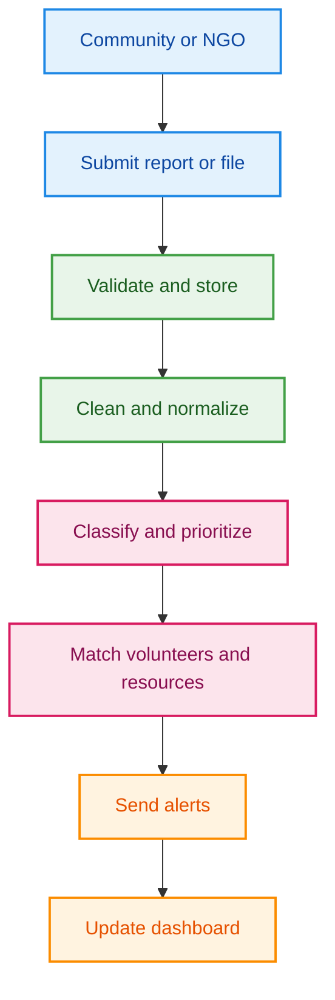

# Smart Resource Allocation & Volunteer Coordination Platform

> AI-powered platform that collects community needs, detects urgent cases, matches volunteers, allocates resources, and gives NGOs a live decision dashboard.

<p align="center">
  
  
  
  
  
  
</p>

## Project Snapshot

This platform turns scattered community information into action. It accepts reports from mobile apps, online forms, NGO files, and scanned paper surveys, then cleans the data, detects urgency, recommends volunteer-task matches, allocates resources, and updates live dashboards.

| Focus | Outcome |
| --- | --- |
| Community data | One place for forms, field reports, CSV uploads, and OCR surveys |
| AI intelligence | Classifies needs, scores priority, predicts shortages, and finds risk zones |
| Volunteer coordination | Matches tasks using skill, availability, distance, urgency, and workload |
| Resource operations | Tracks inventory, deliveries, shortages, and emergency response |
| NGO visibility | Heatmaps, live status, emergency reports, and stakeholder summaries |

---

## 📱 Android Application (`/app`)

A production-ready Kotlin Android application for NGO volunteer coordination. Volunteers receive tasks, submit GPS-tagged field surveys, track their impact, and receive real-time notifications — all backed by Supabase.

### 🔐 Features

- **Authentication**: Email/password sign-up and login via Supabase Auth. Session persistence with auto-login.
- **Dashboard**: Personalized greeting, impact stats (tasks completed & hours), active task card with urgency indicator, top urgent open tasks, recent surveys.
- **Task Management**: Browse and accept open tasks, manage ongoing tasks with field notes, review completed tasks. Urgency color system (Critical to Minor) and Room DB offline cache fallback.
- **Field Surveys**: Category dropdown, severity slider (1-5), affected counter, auto-capture GPS, photo upload to Supabase Storage, and validation.
- **Notifications**: Real-time notification list, unread indicators, dot badges, type badges.
- **Profile**: Editable profile (name, phone, area), skill chips, availability dropdown, photo upload.

### 🏗️ Android Tech Stack

| Component | Technology |
| --- | --- |
| **Language** | Kotlin |
| **Architecture** | MVVM (ViewModel + StateFlow) |
| **DI** | Hilt (Dagger) |
| **Backend** | Supabase (PostgreSQL + Auth + Storage) |
| **Network** | Ktor Android Client |
| **Local DB** | Room Database (offline cache) |
| **Navigation** | Jetpack Navigation + Safe Args |
| **Location** | Google Play Services Location |
| **Images** | Glide |
| **UI** | Material Design 3 + ViewBinding |

### 🚀 Android Getting Started

1. Set up your Supabase project and execute `supabase_setup.sql` in the SQL editor.
2. Create a `local.properties` file in the project root:
   ```properties
   SUPABASE_URL=https://your-project-id.supabase.co
   SUPABASE_ANON_KEY=your-anon-key
   MAPS_API_KEY=your-maps-key
   ```
3. Open in Android Studio, sync Gradle, and run.

---

## 💻 Web Frontend (`/frontend`)

A Flutter-based web dashboard for coordinators and NGO administrators to monitor incoming reports, approve tasks, and track resource allocation.

---

## Architecture



## Layer Responsibilities

| Layer | Includes |
| --- | --- |
| Client Layer | Web portal, Flutter mobile app, NGO dashboard, volunteer app |
| Data Collection | Online forms, field reports, CSV/Excel uploads, OCR scans, mobile inputs |
| Backend Services | Spring Boot APIs, authentication, uploads, validation |
| Cloud Storage | Firestore, Google Cloud Storage, PostgreSQL/MySQL, BigQuery |
| ETL Processing | Cleaning, normalization, duplicate removal, transformation |
| AI ML Engine | Priority detection, need classification, risk analysis, prediction |
| Allocation Engine | Task assignment, volunteer allocation, resource distribution, geo optimization |
| Notifications | SMS alerts, push notifications, emails, emergency broadcasts |
| Analytics | Heatmaps, volunteer status, resource tracking, emergency reports |

## Roadmap



## Data Flow



## MVP Scope

- Role-based authentication for admin, NGO, coordinator, and volunteer users.
- Need report submission through form, mobile input, CSV/Excel upload, and scanned survey.
- Basic data validation, ETL cleaning, duplicate detection, and priority scoring.
- Volunteer profile with skills, availability, GPS location, and task status.
- AI-assisted task matching with coordinator approval.
- Push notification, SMS alert, and email notification support.
- NGO/admin dashboard with heatmap, volunteer status, resource tracking, and reports.

## Tech Stack

| Area | Recommended Stack |
| --- | --- |
| Frontend | Flutter, Flutter Web |
| Backend | Spring Boot REST APIs, Google Cloud Functions or Cloud Run |
| Auth | Supabase Auth, Spring Security, JWT |
| Database | Firestore, PostgreSQL/MySQL, BigQuery |
| Storage | Google Cloud Storage |
| AI ML | Vertex AI, TensorFlow, Google Cloud AI APIs |
| Notifications | Firebase Cloud Messaging, SMS Gateway, Email Service |
| DevOps | GitHub Actions, Docker, Google Cloud Platform |

<details>
<summary><strong>Open Full Documentation</strong></summary>

## Problem

NGOs and community teams often receive information from disconnected sources such as paper surveys, field reports, calls, spreadsheets, and mobile messages. This causes duplicate reports, slow prioritization, poor resource visibility, and delayed volunteer assignment.

## Goal

Build one platform that collects community needs, cleans and organizes the data, uses AI to find urgency, assigns volunteers and resources, sends alerts, and gives NGOs a live operational dashboard.

## User Roles

| Role | Responsibility |
| --- | --- |
| Community Member | Submits needs and requests |
| Volunteer | Accepts tasks, reaches locations, submits completion feedback |
| Coordinator | Uploads reports, validates data, approves task matches |
| NGO Admin | Tracks needs, volunteers, resources, and impact reports |
| System Admin | Manages roles, security, configuration, and audits |

## Detailed Modules

### Client Applications

The web portal, Flutter mobile app, NGO dashboard, and volunteer app provide role-specific access. Volunteers can manage skills and tasks, coordinators can upload reports and approve matches, and NGOs can monitor operations through dashboards.

### Data Collection

The platform collects online form submissions, field reports, NGO spreadsheets, scanned paper surveys, and mobile inputs. OCR converts paper survey images into digital text before validation.

### Backend Services

Spring Boot REST APIs handle users, reports, files, tasks, resources, dashboards, and notifications. Authentication can be managed through Firebase Auth with Spring Security/JWT for API protection.

### Storage

Firestore stores real-time app data, Google Cloud Storage stores uploaded files, PostgreSQL/MySQL stores relational records, and BigQuery supports analytics and historical reporting.

### ETL Pipeline

The ETL layer cleans invalid values, normalizes categories and locations, removes duplicates, transforms raw reports into structured records, and prepares analytics-ready data.

### AI ML Engine

AI models classify needs, detect priority, analyze area risk, predict shortages, and recommend volunteer-task matches using skill, distance, availability, urgency, workload, and safety constraints.

### Resource Allocation

The allocation engine creates tasks, assigns volunteers, links required resources, tracks delivery status, and uses location data to reduce response time.

### Notification System

Firebase Cloud Messaging, SMS, and email are used for task alerts, reminders, emergency broadcasts, status updates, and stakeholder summaries.

### Analytics Dashboard

Dashboards show live heatmaps, need categories, volunteer availability, resource inventory, delivery progress, emergency reports, and trend summaries.

## Core Data Entities

| Entity | Key Fields |
| --- | --- |
| User | userId, name, phone, email, role, organizationId, status |
| Volunteer | volunteerId, skills, availability, location, workload, completedTasks |
| Need Report | reportId, sourceType, category, description, location, severity, priorityScore |
| Task | taskId, needReportId, assignedVolunteerId, status, deadline, feedback |
| Resource | resourceId, name, category, availableQuantity, allocatedQuantity, location |
| Notification | notificationId, recipientId, channel, message, status, sentAt |

## API Modules

| Module | Example APIs |
| --- | --- |
| Authentication | register, login, refresh token, get profile, update role |
| Need Reports | create report, upload attachment, validate, update priority |
| Volunteers | create profile, update skills, update availability, get assigned tasks |
| Tasks | create task, assign task, update status, upload completion proof |
| Resources | add inventory, allocate resource, track delivery, mark shortage |
| Dashboard | heatmap data, volunteer summary, resource summary, emergency reports |

## Matching Score

```text
matchingScore =
  skillMatchScore * 0.35 +
  distanceScore * 0.25 +
  availabilityScore * 0.20 +
  urgencyScore * 0.10 +
  workloadBalanceScore * 0.10
```

## Suggested Repository Structure

```text
smart-resource-allocation-platform/
|-- backend/
|-- mobile_app/
|-- web_dashboard/
|-- ml_engine/
|-- cloud_functions/
|-- docs/
|-- diagrams/
|-- .github/workflows/
`-- README.md
```

## Testing And Deployment

- Unit and integration tests for backend services.
- Mobile and web UI testing for key user flows.
- Security testing for authentication, file uploads, and role permissions.
- CI/CD with GitHub Actions.
- Pilot rollout with selected NGOs, then regional and larger deployment.

## Future Extensions

- Multi-language support.
- Government open-data integration.
- Chatbot assistant for volunteers and coordinators.
- Predictive analytics for resource shortages.
- Transparent public reporting for non-sensitive aggregated data.
- Blockchain-based audit trail for resource distribution.

## Success Metrics

- Faster identification of urgent needs.
- Higher successful volunteer-task match rate.
- Reduced duplicate reports.
- Faster resource delivery.
- Better NGO visibility into volunteers, inventory, and emergencies.

</details>
