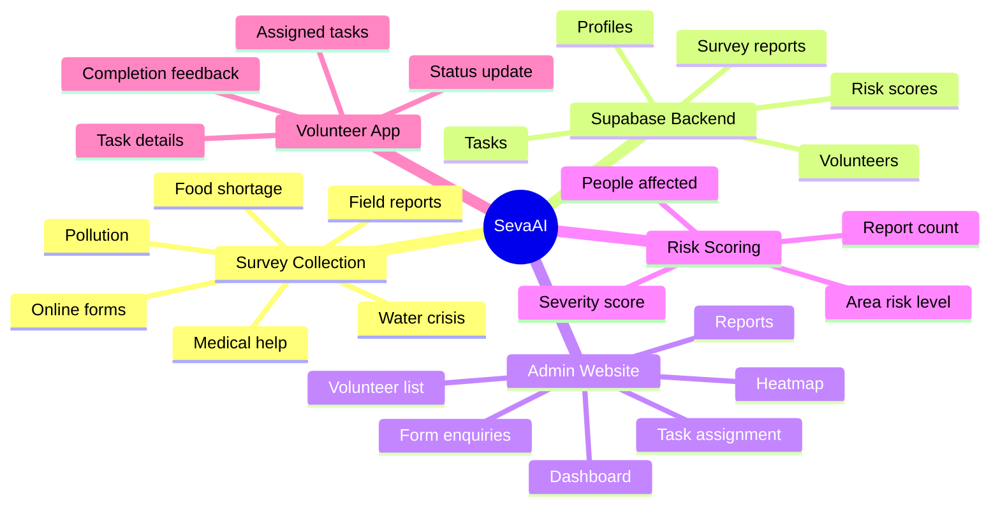
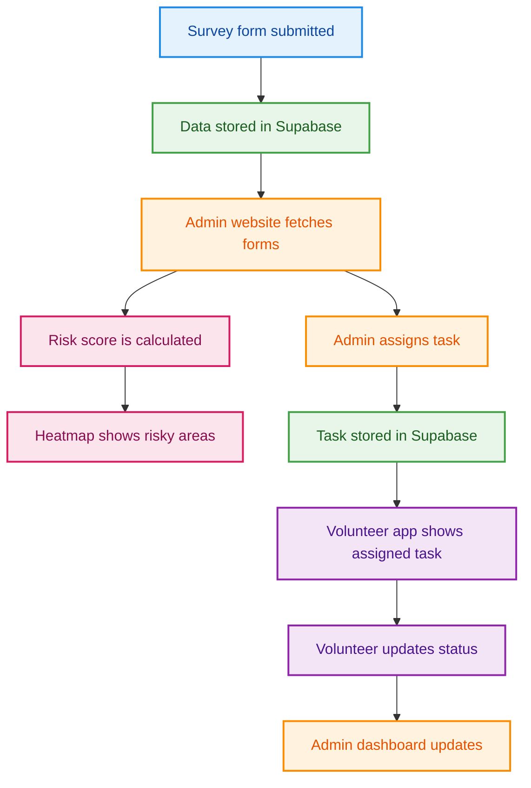
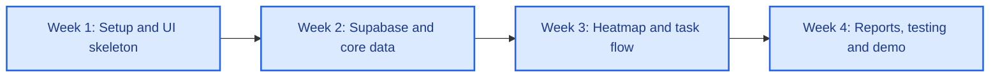
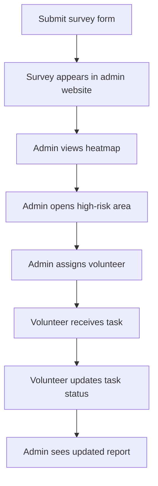

# SevaAI - Smart NGO Survey, Heatmap & Volunteer Coordination Platform

> A simple but powerful NGO management system where survey forms are collected, area problems are shown on a heatmap, and admins assign volunteers to solve real community issues.

<p align="center">
  
  
  
  
  
</p>

---

## Project In Simple Words

SevaAI is a platform for NGOs and social workers.

People fill survey forms about problems in their area, like water crisis, pollution, food shortage, medical help, education support, or sanitation issues. The admin website collects all these forms, shows the problem areas on a heatmap, and allows the admin to assign volunteers to solve those problems.

The volunteer app shows each volunteer their assigned work, location, priority, and task status.

In one line:

> SevaAI collects community problems, shows risky areas on a heatmap, and helps admins assign volunteers to solve them.

---

## Simple Example

| Survey Input | System Output |
| --- | --- |
| City: Jaipur | Admin sees Jaipur survey |
| Area: Mansarovar | Mansarovar appears on heatmap |
| Problem: Water Crisis | Problem category becomes Water Crisis |
| Severity: High | Area becomes high risk |
| People affected: 500 | Risk score increases |
| Admin assigns volunteer | Volunteer sees task in app |

---

## What We Are Building

| Part | Purpose |
| --- | --- |
| Admin Website | Admin views surveys, heatmap, volunteers, tasks, and reports |
| Volunteer App | Volunteers view assigned tasks and update task status |
| Supabase Backend | Stores forms, users, volunteers, tasks, and heatmap data |
| Risk Scoring Model | Calculates which areas are low, medium, high, or critical risk |
| Heatmap | Shows area-wise crisis visually on a map |

---

## Mind Map



---

## How The Project Works



---

## Tech Stack

| Layer | Technology |
| --- | --- |
| Admin Website | React + TypeScript + Vite |
| Admin UI | Ant Design |
| Volunteer App | React Native Expo or mobile-style React app |
| Database | Supabase PostgreSQL |
| Auth | Supabase Auth |
| File Upload | Supabase Storage |
| Realtime Updates | Supabase Realtime |
| Heatmap | React Leaflet + Leaflet |
| Charts | Recharts |
| Animation | Anime.js |
| Deployment | Vercel for admin website, Expo for volunteer app |

---

## Supabase Database Tables

| Table | What It Stores |
| --- | --- |
| `profiles` | Admin and volunteer user profiles |
| `survey_reports` | Survey form enquiries submitted by users/field workers |
| `volunteers` | Volunteer details, skills, location, and availability |
| `tasks` | Work assigned by admin to volunteers |
| `task_updates` | Status updates submitted by volunteers |
| `area_risk_scores` | Heatmap risk score for each area/problem |

### Important Fields

| Table | Main Fields |
| --- | --- |
| `survey_reports` | `id`, `city`, `area`, `problem_type`, `severity`, `description`, `people_affected`, `latitude`, `longitude`, `status`, `created_at` |
| `volunteers` | `id`, `full_name`, `skills`, `city`, `area`, `availability`, `phone` |
| `tasks` | `id`, `survey_report_id`, `volunteer_id`, `title`, `priority`, `status`, `assigned_at`, `completed_at` |
| `area_risk_scores` | `id`, `city`, `area`, `problem_type`, `risk_score`, `risk_level`, `latitude`, `longitude` |

---

## Low-Cost Risk Scoring Model

We are not building an expensive ML pipeline.

For this 1-month project, we will use a lightweight risk scoring model.

```text
riskScore =
  severityScore * 0.5 +
  reportCountScore * 0.25 +
  peopleAffectedScore * 0.25
```

| Risk Score | Risk Level | Heatmap Color |
| --- | --- | --- |
| 0-25 | Low | Green |
| 26-50 | Medium | Yellow |
| 51-75 | High | Orange |
| 76-100 | Critical | Red |

This makes the project realistic, low-cost, and easy to complete within the deadline.

---

## Core Features

### Admin Website

| Feature | Priority |
| --- | --- |
| Login page | Must have |
| Dashboard overview | Must have |
| Survey enquiry table | Must have |
| Heatmap page | Must have |
| Volunteer list | Must have |
| Task assignment | Must have |
| Reports and analytics | Must have |
| Admin profile/settings | Good to have |

### Volunteer App

| Feature | Priority |
| --- | --- |
| Volunteer login | Must have |
| Assigned task list | Must have |
| Task details | Must have |
| Status update | Must have |
| Completion feedback | Good to have |
| Location/map view | Good to have |

---

## 1-Month Roadmap



---

## Week 1 Random Work Assignment

In Week 1, everyone works on setup, research, UI skeletons, and small independent modules. This helps the team move fast without waiting for backend completion.

| Member | Week 1 Random Task | Output |
| --- | --- | --- |
| Aashita | Login page and NGO admin profile UI | Login screen, profile screen |
| Ankit | Heatmap UI research and map page skeleton | Basic map page with dummy points |
| Arora | Survey page UI and volunteer page UI | Survey table, volunteer table |
| Ansh | Task allocation and analytics UI skeleton | Task table, analytics cards |
| Member 5 | Supabase project setup and database planning | Supabase project, table plan |
| Member 6 | Form enquiry design and dummy survey data | Sample survey form and mock data |
| Member 7 | Volunteer app screen design | Mobile task list and task details UI |
| Member 8 | README, presentation flow, testing checklist | Documentation and demo plan |

> Replace Member 5, Member 6, Member 7, and Member 8 with the actual names of your teammates.

---

## Detailed Work Plan For Next 3 Weeks

### Week 2: Supabase + Core Data

| Member | Responsibility | Detailed Work | Final Output |
| --- | --- | --- | --- |
| Aashita | Auth and layout | Connect login UI with Supabase Auth, build protected layout, sidebar, top navbar | Admin can login and see dashboard layout |
| Ankit | Heatmap data structure | Create map page, define area coordinates, connect dummy risk data from Supabase | Heatmap page reads data from Supabase |
| Arora | Surveys and volunteers | Build survey enquiry table, volunteer list, search, filters, status tags | Admin can view forms and volunteers |
| Ansh | Tasks and analytics | Build task table, task status cards, basic analytics charts | Admin can view tasks and metrics |
| Member 5 | Supabase database | Create tables: `profiles`, `survey_reports`, `volunteers`, `tasks`, `task_updates`, `area_risk_scores` | Working database schema |
| Member 6 | Survey form flow | Build form submission page and insert data into `survey_reports` | Survey data is stored in Supabase |
| Member 7 | Volunteer app | Build volunteer login, assigned task list, task details screen | Volunteer app UI connected to dummy task data |
| Member 8 | Integration and QA | Test Supabase reads/writes, verify routes, create bug list | Stable Week 2 integration |

### Week 3: Heatmap + Task Assignment Flow

| Member | Responsibility | Detailed Work | Final Output |
| --- | --- | --- | --- |
| Aashita | Admin polish | Improve dashboard layout, profile page, navigation, responsive behavior | Professional admin shell |
| Ankit | Heatmap | Implement risk score color logic, filter by city/problem/severity | Working crisis heatmap |
| Arora | Survey management | Add survey detail view, status update, link survey to task creation | Admin can inspect survey and mark status |
| Ansh | Task assignment | Build assign volunteer modal, priority tags, task detail view | Admin can assign work to volunteer |
| Member 5 | Supabase policies | Add basic Row Level Security policies and table relationships | Safer database access |
| Member 6 | Risk scoring model | Write risk score function using severity, report count, people affected | Risk score generated for heatmap |
| Member 7 | Volunteer status update | Connect volunteer task status updates to Supabase | Volunteer can update task progress |
| Member 8 | Testing and docs | Test complete flow from survey to task assignment | End-to-end flow documented |

### Week 4: Reports + Final Demo

| Member | Responsibility | Detailed Work | Final Output |
| --- | --- | --- | --- |
| Aashita | UI final polish | Fix spacing, colors, typography, mobile responsiveness | Clean final UI |
| Ankit | Heatmap finalization | Add legends, filters, popup details, demo-ready data | Presentation-ready heatmap |
| Arora | Surveys/volunteers finalization | Add final filters, empty states, loading states | Stable survey and volunteer module |
| Ansh | Reports and analytics | Build charts, task reports, export button UI, completion metrics | Demo-ready analytics/report page |
| Member 5 | Deployment | Deploy admin website and configure Supabase env variables | Live admin website |
| Member 6 | Data preparation | Prepare realistic demo data for multiple cities and problems | Strong demo dataset |
| Member 7 | Volunteer app finalization | Finalize volunteer app screens and task update flow | Demo-ready volunteer app |
| Member 8 | Final presentation | Create README, screenshots, demo video/script, final testing checklist | Final submission package |

---

## Team Folder Ownership

| Member | Folder Ownership |
| --- | --- |
| Aashita | `src/features/auth/`, `src/features/profile/`, `src/components/layout/` |
| Ankit | `src/features/heatmap/`, `src/features/activity/`, `src/components/maps/` |
| Arora | `src/features/surveys/`, `src/features/volunteers/` |
| Ansh | `src/features/tasks/`, `src/features/analytics/`, `src/features/reports/` |
| Member 5 | `src/services/supabaseClient.ts`, Supabase SQL/schema |
| Member 6 | `src/features/forms/`, `src/utils/riskScoring.ts`, demo data |
| Member 7 | `volunteer-app/` or `src/mobile/` |
| Member 8 | `docs/`, `README.md`, QA checklist, demo script |

---

## Git Branch Plan

| Member | Branch |
| --- | --- |
| Aashita | `feature/aashita-auth-profile-layout` |
| Ankit | `feature/ankit-heatmap-activity` |
| Arora | `feature/arora-surveys-volunteers` |
| Ansh | `feature/ansh-tasks-analytics-reports` |
| Member 5 | `feature/supabase-database` |
| Member 6 | `feature/forms-risk-scoring` |
| Member 7 | `feature/volunteer-app` |
| Member 8 | `feature/docs-testing-demo` |

---

## Final Demo Flow



---

## What To Avoid

| Avoid | Why |
| --- | --- |
| Expensive ML pipeline | Not needed for this deadline |
| Building full custom backend | Supabase is enough |
| Too many features | Will break the deadline |
| Over-animation | Admin tools must be clear and fast |
| No shared design system | Project will look inconsistent |
| Last-day integration | Highest risk of failure |

---

## Final Goal

By the end of the month, the project should clearly show:

- A survey form stores data in Supabase.
- Admin website displays submitted forms.
- Heatmap shows risky areas.
- Admin assigns tasks to volunteers.
- Volunteer app shows assigned work.
- Volunteer updates task status.
- Admin sees reports and analytics.

That is enough to demonstrate a complete, realistic, and understandable working system.

