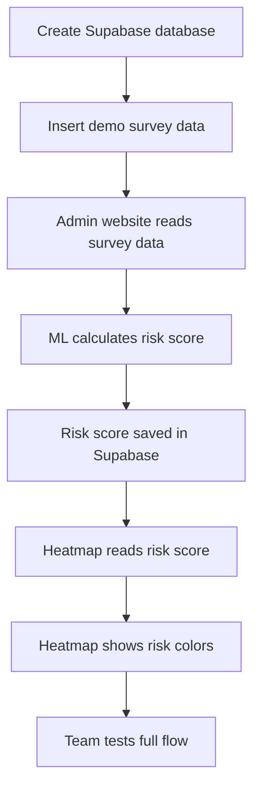

# Phase 2 README - Supabase + ML Heatmap

## Phase 2 Dates

**June 2 - June 13**

## Phase 2 Main Goal

In Phase 2, we will connect the project to Supabase, store survey data, calculate area risk using ML/risk scoring, and show risky areas on a heatmap.

In simple words:

> Survey data goes into Supabase, ML calculates risk, and the heatmap shows which area has which problem.

## What Should Work By June 13

```text
Survey data stored in Supabase
        ↓
Admin website shows survey enquiries
        ↓
ML risk scoring calculates area risk
        ↓
Risk scores are saved in Supabase
        ↓
Heatmap displays risk areas
```
### Phase 2 Day-Wise Plan

| Date | Focus | Owners | Output |
| --- | --- | --- | --- |
| June 2 | Finalize Supabase schema and project setup | Anirudh + Arpit | Supabase project and table plan ready |
| June 3 | Create tables and relationships | Anirudh + Arpit | Database tables ready |
| June 4 | Insert demo survey, volunteer, task, and area data | Arpit + Anirudh + Ananya | Supabase has test data |
| June 5 | Connect admin website to Supabase | Anirudh + Arpit + Abhay | Supabase client working in frontend |
| June 6 | Display survey enquiries from Supabase | Arora + Aashita | Admin can view survey forms |
| June 7 | Build first ML risk scoring function | Ansh + Arhaan | Risk score generated from survey data |
| June 8 | Save ML output into `area_risk_scores` | Ansh + Aashita | Risk scores stored in Supabase |
| June 9 | Build heatmap UI | Aashita + Ansh | Map renders risk locations |
| June 10 | Connect heatmap with ML risk scores | Ankit + Ansh | Heatmap shows calculated area risk |
| June 11 | Add filters, legends, and popups | Ankit + Arhaan + Abhay | Heatmap is demo-friendly |
| June 12 | Test full Supabase + ML + heatmap flow | Abhay + Arhan | Bugs identified and fixed |
| June 13 | Phase 2 freeze and internal demo | Everyone | Supabase + ML heatmap completed |

## What Each Member Will Do

| Member | Main Work | Simple Explanation |
| --- | --- | --- |
| Anirudh | Supabase database | Creates tables, relationships, policies, and helps store ML output |
| Arpit | Demo data | Adds realistic survey, volunteer, task, and area data into Supabase |
| Aashita | Admin website connection | Helps connect admin login/layout and survey/heatmap pages |
| Arora | Survey enquiry page | Shows submitted forms from Supabase in the admin website |
| Ansh | ML risk scoring | Calculates area risk from survey data and saves the result |
| Ankit | Heatmap | Shows the ML risk result on a map using colors |
| Arhan | Integration support | Fixes connection issues, imports, routes, and shared components |
| Abhay | Testing and docs | Tests the full flow, finds bugs, takes screenshots, and writes notes |

## Supabase Tables Needed

| Table | Purpose |
| --- | --- |
| `profiles` | Stores admin and volunteer profiles |
| `survey_reports` | Stores submitted survey forms |
| `volunteers` | Stores volunteer details and availability |
| `tasks` | Stores work assigned to volunteers |
| `task_updates` | Stores volunteer task status updates |
| `area_risk_scores` | Stores ML risk score output for heatmap |

## Important Survey Fields

The ML and heatmap need these fields from survey data:

| Field | Example |
| --- | --- |
| `city` | Jaipur |
| `area` | Mansarovar |
| `problem_type` | Water Crisis |
| `severity` | High |
| `people_affected` | 500 |
| `latitude` | 26.85 |
| `longitude` | 75.76 |

## ML Risk Scoring

The ML part is a lightweight risk scoring model.

It uses:

- Severity
- Number of reports
- People affected
- Problem type

Example formula:

```text
riskScore =
  severityScore * 0.45 +
  reportCountScore * 0.25 +
  peopleAffectedScore * 0.20 +
  problemTypeWeight * 0.10
```

## Risk Level Output

| Risk Score | Risk Level | Heatmap Color |
| --- | --- | --- |
| 0-25 | Low | Green |
| 26-50 | Medium | Yellow |
| 51-75 | High | Orange |
| 76-100 | Critical | Red |

## Example ML Output

| Area | Problem | Severity | People Affected | Risk Score | Risk Level | Heatmap Color |
| --- | --- | --- | --- | --- | --- | --- |
| Mansarovar | Water Crisis | High | 500 | 86 | Critical | Red |
| Vaishali Nagar | Pollution | Medium | 300 | 64 | High | Orange |
| Malviya Nagar | Food Shortage | Medium | 120 | 48 | Medium | Yellow |
| Jagatpura | Education Support | Low | 50 | 26 | Low | Green |

## Heatmap Work

The heatmap will show area risk visually.

| Heatmap Feature | Meaning |
| --- | --- |
| Marker color | Shows risk level |
| Red marker | Critical risk |
| Orange marker | High risk |
| Yellow marker | Medium risk |
| Green marker | Low risk |
| Popup | Shows area, problem, risk score, people affected |
| Filters | Filter by city, problem type, severity, and risk level |
| Legend | Explains what each color means |

## Phase 2 Build Flow



## Folder Suggestions

| Work | Suggested Folder |
| --- | --- |
| Supabase client | `src/services/supabaseClient.ts` |
| Survey enquiries | `src/features/surveys/` |
| ML risk scoring | `src/features/ml/` or `src/utils/riskScoring.ts` |
| Heatmap | `src/features/heatmap/` |
| Shared tags/cards | `src/components/common/` |
| Testing notes | `docs/testing/` |

## Phase 2 Completion Checklist

By June 13, these things must be complete:

- [ ] Supabase project created
- [ ] Tables created
- [ ] Demo survey data inserted
- [ ] Admin website connected to Supabase
- [ ] Survey enquiry table showing data
- [ ] ML risk scoring function working
- [ ] Risk scores saved into `area_risk_scores`
- [ ] Heatmap showing risk areas
- [ ] Filters, legends, and popups added
- [ ] Full flow tested
- [ ] Screenshots collected

## Final Phase 2 Demo Flow

The demo should show:

1. Survey data exists in Supabase.
2. Admin website displays the survey forms.
3. ML calculates risk score from survey data.
4. Risk score is saved into Supabase.
5. Heatmap displays risk areas with colors.
6. Filters and popups work.

## Important Rule

Do not wait for everything to be perfect.

Work in parallel:

```text
Supabase team builds database
Survey team builds table UI
ML team builds scoring with mock data
Heatmap team builds map with dummy points
Integration team connects everything later
```

This saves time and prevents last-day failure.

